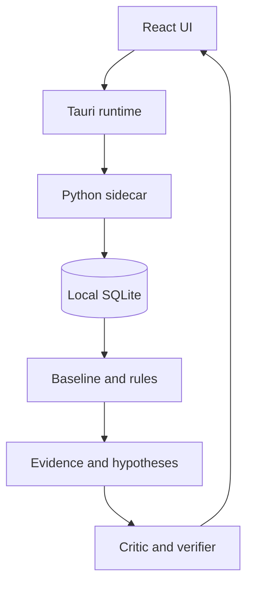

# SherlockPC

### Понять нагрузку. Проверить факты. Сохранить историю.

Локальное Windows-приложение для наблюдения за ПК и проверки отклонений CPU, памяти и подкачки.

**v0.1 · Release candidate · Windows x64 · 12 языков**


## Что делает приложение

SherlockPC автоматически снимает состояние системы примерно каждые 10 секунд, сохраняет его в SQLite и сравнивает новые измерения с предыдущими. Отчёт показывает наблюдения, ограниченные гипотезы, проверку доказательств и границы выводов.

| Раздел | Для чего нужен |
|---|---|
| **Обзор** | CPU, память, подкачка, число процессов, последние замеры и готовность истории |
| **Расследование** | Итог, наблюдения, ход проверки, ограничения и ссылки на факты |
| **История** | Все сохранённые замеры с постраничным просмотром, путь к базе и очистка с подтверждением |
| **Настройки** | Автозапуск Windows, светлая / тёмная / системная тема и управление историей |

Кнопка **«Снять замер»** создаёт новое измерение. **«Проверить»** создаёт отчёт, который остаётся неизменным до следующего расследования. Закрытие окна оставляет сбор в трее; пункт **«Выход — остановить сбор»** завершает программу.

## Что нового в v0.1

- Исправлен запуск с лишней консолью: Windows-приложение собирается с GUI-подсистемой. Крестик скрывает окно в трей; сбор истории продолжается. Завершение — через меню трея.
- Публичная версия — **0.1**; технические версии Cargo/npm/Tauri — **0.1.0**.

- Исправлена передача Unicode между Windows backend и UI: кириллица, ¿, акценты и иероглифы возвращаются в поле вопроса без потерь.
- Нижняя кнопка папки истории теперь всегда доступна отдельно от просмотра ошибки; открывает реальную папку базы.
- Нумерация упрощена до `#67`; арабский интерфейс поддерживает RTL.
- Японские, корейские, арабские и деванагари-шрифты включаются в сборку для работы офлайн.

- Двенадцать языков с переключением без перезапуска: **English, Русский, Español, Português (Brasil), 简体中文, Français, Italiano, Deutsch, 日本語, 한국어, العربية, हिन्दी**. Китайский — упрощённый, португальский — бразильский.
- Переведены интерфейс, диалоги, стандартные диагностические выводы и меню трея. Даты, числа и длительности учитывают язык.
- Выбранные язык и тема сохраняются на этом ПК; первый язык определяется по системе, с английским как запасным.
- Единые визуальные стили, контрастные карточки метрик и индикаторы загрузки ресурсов.
- Готовность базы сравнения рассчитывается по фактическим требованиям к числу замеров и периоду наблюдения; это **не оценка здоровья ПК**.
- Тренд CPU/RAM с временными отметками и различимыми линиями; скрывается в компактном окне, чтобы оставить место результату.
- Поддержка клавиатуры, видимый фокус, системное ограничение анимации, понятные пустые состояния и ошибки.

## Быстрый старт

Для конечного пользователя нужен собранный **`SherlockPC-v0.1-Setup.exe`**. Исходный ZIP не содержит нового EXE: его нужно собрать на Windows. Python, Node.js и Rust на компьютере пользователя установленной программы не требуются.

1. Установите приложение и откройте SherlockPC.
2. Выберите язык в правом верхнем углу.
3. Дождитесь первых замеров. Для сравнения с историей нужны достаточное число наблюдений **и** достаточный период; точные требования видны в индикаторе.
4. Нажмите «Проверить CPU» или «Проверить память», затем «Проверить».
5. Откройте «Расследование», чтобы посмотреть факты и ограничения.

## Честные границы версии

- Вопрос — **подпись к фиксированной проверке CPU/RAM/swap**, а не произвольная команда для LLM. Кнопки CPU и памяти подставляют вопрос, но не отключают остальные правила проверки.
- Сигнал нагрузки не доказывает причину торможения, неисправность или утечку памяти. Отсутствие отклонений не подтверждает здоровье всего ПК.
- Правила эвристические; проценты вероятности неисправности не вычисляются.
- Search / Recall / Actions пока не доступны в desktop UI. В Python-коде уже есть State Diff, индексация файлов и SherlockBench — это отдельные инструменты, не кнопки приложения.
- Диагностические идентификаторы, имена процессов, пути и исходные технические ошибки сохраняются без перевода. Неизвестные будущие сообщения выводятся как есть.
- Полная Windows-сборка, установщик, автозапуск и трей требуют проверки на Windows перед публикацией.

## Данные и приватность

Телеметрия и диагностика выполняются локально. База по умолчанию:

```text
%LOCALAPPDATA%\SherlockPC\data\sherlock.db
```

Точный путь виден в «Истории» и «Настройках»; **«Открыть папку»** ведёт к нему. Для резервной копии сначала завершите SherlockPC через трей, затем скопируйте папку данных. Очистка истории необратима и требует подтверждения; после неё сбор начинает новую историю. При сбросе удаляются относящиеся к замерам системные и процессные измерения.

Сведения о процессах могут содержать личную информацию. Не публикуйте свою базу вместе с релизом.

## Разработка и сборка

**Windows:** Python 3.11+ (рекомендуется 3.12), Node.js 22.12+ или 24 LTS, Rust stable с MSVC toolchain, Visual Studio Build Tools с C++ и Windows SDK, WebView2 Runtime.

```bat
RUN_DESKTOP_DEV.cmd
```

Полная проверка, сборка sidecar, desktop и NSIS-установщика:

```bat
BUILD_DESKTOP_WINDOWS.cmd
```

Результат успешной сборки:

```text
release/
  SherlockPC-v0.1-Setup.exe
  SHA256SUMS.txt
  RELEASE_NOTES.md
```

Обычный `sherlockpc.exe` находится в `desktop/src-tauri/target/release/`. Не раздавайте его отдельно от backend; для пользователей предназначен установщик.

### Проверки исходников

```bash
python -m pip install -e ".[dev]"
python -m pytest -q
cd desktop
npm ci
npm run check
npm test
npm run build
npx playwright install chromium
npm run test:ui
```

Регрессионные тесты запускают реальный Python bridge с CP1251, CP1252 и ASCII, проверяя сохранность всех 12 языков.

UI-тесты используют фикстуру через имитацию IPC и не изменяют настоящую историю ПК. Они проверяют раскладку, 12 языков, темы, сохранение настроек, смену состояний и подтверждение удаления. Native-функции тестируются отдельно в Windows smoke-check.

## Стек и устройство

| Слой | Технологии и ответственность |
|---|---|
| UI | React 19, TypeScript, Vite; JSON-каталоги переводов, CSS-токены |
| Desktop | Tauri 2 / Rust: трей, автозапуск, один экземпляр, запуск sidecar |
| Core | Python, psutil: сбор измерений и bounded investigation |
| Хранение | SQLite, история состояний и процессов, evidence IDs |
| Сборка | PyInstaller для sidecar, NSIS для установки |



Основные папки: `desktop/src` — интерфейс; `desktop/src/locales` — переводы; `desktop/src-tauri` — desktop runtime; `sherlock` — ядро; `tests` — Python-тесты; `build_support` — упаковка.


[SherlockBench dataset Kaggle](https://www.kaggle.com/datasets/fireaideveloper/sherlockbench-windows-workload-telemetry) · [SherlockBench dataset Hugging Face](https://huggingface.co/datasets/fireaideveloper/SherlockBench) · [GitHub](https://github.com/fireaideveloper/SherlockPC)
