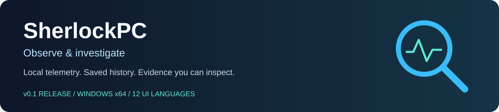
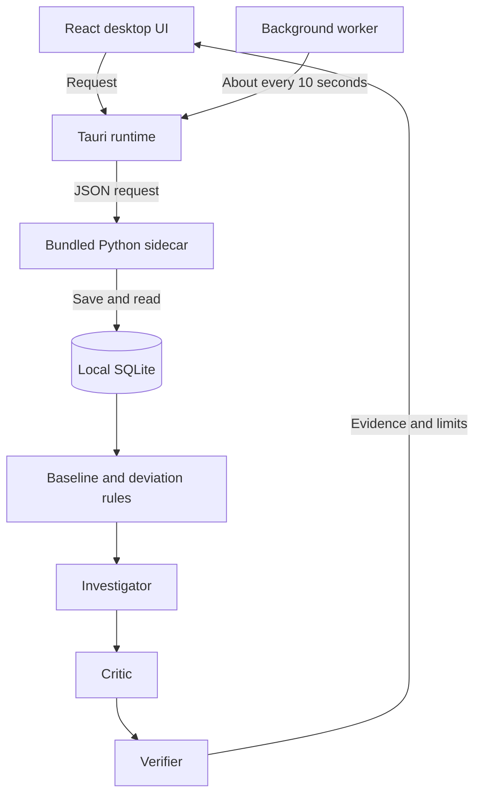
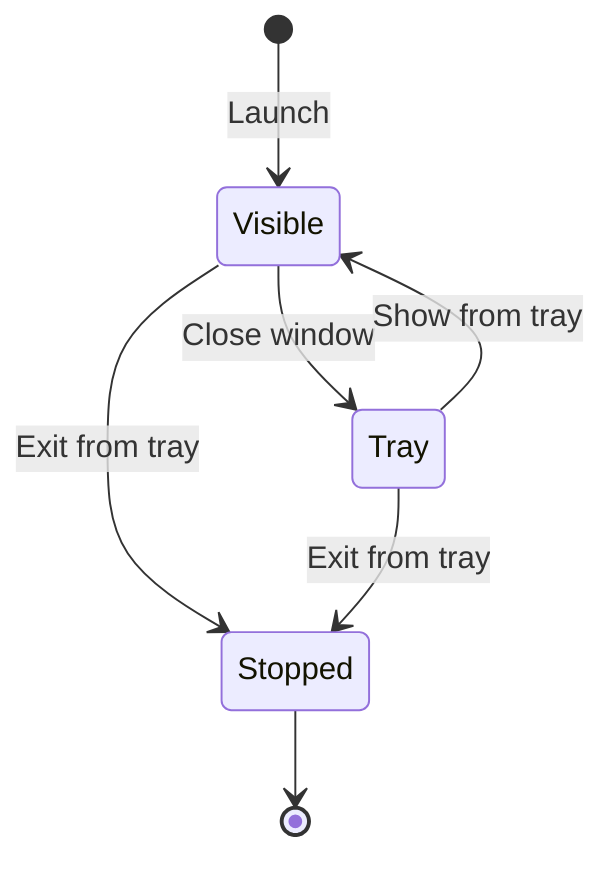

# SherlockPC



**English** · [Русский](README.ru.md) · [Documentation](docs/README.md) · [Download release](https://github.com/fireaideveloper/SherlockPC/releases) · [Report an issue](https://github.com/fireaideveloper/SherlockPC/issues)

**Understand the load. Check the facts. Keep the history.**

SherlockPC is a local Windows desktop application that records system and process measurements and checks CPU, RAM and swap against saved history. Reports connect observations and bounded hypotheses to evidence, with explicit limits on what the data can prove.

**v0.1 · Released · Windows x64 · Local processing · 12 interface languages**

Public version: [0.1](VERSION). npm, Cargo and Tauri use the technical version `0.1.0`. This documentation describes the released version; broader design documents include future plans.

## Contents

[Start here](#start-here) · [Features](#features) · [Using the app](#using-the-app) · [How it works](#how-it-works) · [Languages](#languages) · [Privacy and storage](#privacy-and-storage) · [Development](#development) · [Project map](#project-map) · [Troubleshooting](#troubleshooting) · [Limits](#limits) · [Links and licenses](#links-and-licenses)

## Start here

| I want to… | Open |
|---|---|
| Install and use SherlockPC | [Released installers](https://github.com/fireaideveloper/SherlockPC/releases), then [Using the app](#using-the-app) |
| Read in Russian | [Русский README](README.ru.md) |
| See the v0.1 changes | [Release notes](RELEASE_NOTES_v0.1.md) |
| Run or build the desktop app | [Desktop guide](docs/desktop.md) |
| Find a source file | [Project map](#project-map) or [complete file index](docs/files.md) |
| Understand the long-term design | [Architecture](docs/architecture.md) and [Threat model](docs/threat-model.md) — design documents |
| Explore Python tools | [CLI guide](docs/cli.md) |

Download **`SherlockPC-v0.1-Setup.exe`** from the release page, install it and open SherlockPC. The installed application bundles its Python backend; users do not need Python, Node.js or Rust. The source ZIP is for development and does not contain the installer.

If the release includes `SHA256SUMS.txt`, compare its hash with this PowerShell output from your download folder:

```powershell
Get-FileHash .\SherlockPC-v0.1-Setup.exe -Algorithm SHA256
```

## Features

| Feature | Available in v0.1 |
|---|---|
| Live overview | CPU, RAM, swap, process count and recent saved states |
| Automatic history | A native worker targets one measurement about every 10 seconds |
| Bounded investigation | Baseline comparison, observations, hypotheses, evidence references and verification |
| History browser | Saved states with pagination, database location and confirmed clearing |
| Background operation | Closing the window hides it in the tray and keeps collecting |
| Windows autostart | Optional background launch when you sign in |
| Appearance and localization | Light, dark and system themes; 12 languages; saved preferences |
| Developer tools | State Diff, file indexing/search and workload experiments through Python |

## Using the app

1. Select a language in the top-right corner and choose a theme in Settings.
2. Leave SherlockPC running to build a comparison history. Readiness depends on **both sample count and elapsed observation span**. Default requirements are 30 historical samples and a 300-second span; the app shows progress.
3. Choose **Check CPU** or **Check memory**, or enter a question as a label for the check.
4. Press **Investigate →**, then open **Investigation** to inspect findings, evidence, trace and limits.
5. Browse **History** for saved states. Enable sign-in autostart in **Settings** if needed.

| View or control | What it does |
|---|---|
| Overview | Shows the latest state, recent load and baseline readiness |
| Refresh state | Captures and saves a new state; it does not rerun an investigation |
| Check CPU / Check memory | Fills in a question; both presets still run the full CPU/RAM/swap rules |
| Investigate | Creates a report that stays fixed until the next investigation |
| History / Reload list | Browses or reloads saved states |
| Open folder / History location | Opens the real directory containing `sherlock.db` |
| Clear all states | Asks for confirmation, removes saved states and their related measurements; collection starts a new history |
| Settings | Controls appearance, background autostart and history management |
| Window close button | Hides the app in the system tray; collection continues |
| Tray: Exit — stop collecting | Exits the application and stops collection |

**Reading a result:** “Building history” means there is not enough comparison data. “Signals found” indicates deviations under the selected rules. “No deviations found” only means those rules found no supported deviations. Baseline readiness is a data-availability indicator, not a PC health score.

## How it works

The current desktop uses deterministic Python checks. It does not require an LLM or cloud API.



The Rust runtime remains active in the tray. The backend is a **one-shot sidecar per request**, not a persistent Python service. Collection and manual refresh share a gate so an older response cannot overwrite a newer state.



Collection continues in the Visible and Tray states. See [desktop implementation](docs/desktop.md) and [source navigation](docs/files.md).

## Languages

| Locale | Interface language | Locale | Interface language |
|---|---|---|---|
| `en` | English | `fr` | Français |
| `ru` | Русский | `it` | Italiano |
| `es` | Español | `de` | Deutsch |
| `pt-BR` | Português (Brasil) | `ja` | 日本語 |
| `zh-CN` | 简体中文 | `ko` | 한국어 |
| `ar` | العربية | `hi` | हिन्दी |

Language changes apply without restarting. The system language determines the initial choice, with English as fallback. Dates, numbers and durations are localized; Arabic supports RTL. Bundled Noto fonts support offline rendering. Technical IDs, process names, paths and raw errors keep their original text.

Translation files: [locale catalogs](desktop/src/locales) · [language selection](desktop/src/i18n.ts) · [report text](desktop/src/reportText.ts) · [font licenses](licenses).

## Privacy and storage

Collection and diagnosis run locally. The packaged Windows application uses:

```text
%LOCALAPPDATA%\SherlockPC\data\sherlock.db
```

The actual path is shown in History and Settings. Development/tests can override it with `SHERLOCK_DB_PATH`. Standalone CLI tools may use different databases; see the [CLI guide](docs/cli.md).

To back up history, exit from the tray first and copy the **whole data folder**. Clearing states is irreversible and requires confirmation; automatic collection then starts a new history. Process metadata and paths may contain personal information, so keep your history database out of shared release archives.

The [threat model](docs/threat-model.md) describes broader security goals; it is not a guarantee that every planned safeguard is implemented in v0.1.

## Development

Run commands from the repository root unless specified otherwise.

| Requirement | Developer machine |
|---|---|
| OS for release packaging | Windows x64 |
| Python | 64-bit Python 3.11+; 3.12 is used by Windows CI |
| Node.js | 22.12+; Node 24 is used by Windows CI |
| Rust | Stable MSVC toolchain, `x86_64-pc-windows-msvc` |
| Native tools | Visual Studio Build Tools with C++ and Windows SDK |
| Desktop runtime | WebView2 Runtime |

Start the desktop development environment:

```bat
RUN_DESKTOP_DEV.cmd
```

Build the backend, validate source checks, build Tauri/NSIS and package release artifacts:

```bat
BUILD_DESKTOP_WINDOWS.cmd
```

After a successful build, `release/` contains `SherlockPC-v0.1-Setup.exe`, `SHA256SUMS.txt` and `RELEASE_NOTES.md`. The standalone native executable is `desktop/src-tauri/target/release/sherlockpc.exe`; distribute the installer so users receive the bundled backend. [Full build guide](docs/desktop.md).

### Source checks

```bash
python -m pip install -e ".[dev]"
python -m pytest -q
cd desktop
npm ci
npm run check
npm test
npm run build
npx playwright install chromium
npm run test:ui
```

Python bridge tests cover CP1251, CP1252 and ASCII environments. Browser UI tests use a mock IPC fixture and do not alter your real history. Tray, autostart and installer behavior require native Windows checks; browser tests do not cover them.

## Project map

| Area | Entry points | Responsibility |
|---|---|---|
| Desktop UI | [App.tsx](desktop/src/App.tsx), [styles.css](desktop/src/styles.css), [api.ts](desktop/src/api.ts) | Views, appearance and native calls |
| Localization | [i18n.ts](desktop/src/i18n.ts), [catalogs](desktop/src/locales), [reportText.ts](desktop/src/reportText.ts) | Language selection and report strings |
| Native runtime | [lib.rs](desktop/src-tauri/src/lib.rs), [background.rs](desktop/src-tauri/src/background.rs) | Worker, tray, autostart and single instance |
| Python bridge | [desktop_bridge.py](sherlock/desktop_bridge.py), [service.py](sherlock/desktop/service.py) | JSON operations and desktop service |
| History | [history.py](sherlock/desktop/history.py), [SQLite storage](sherlock/storage/sqlite) | Persistence, paging and clearing |
| Collection and checks | [capabilities](sherlock/capabilities), [investigation engine](sherlock/investigation/engine.py) | Measurements, baseline, evidence and verification |
| Release packaging | [sidecar builder](build_support/build_desktop_sidecar.py), [packager](build_support/package_desktop_release.py) | Bundled backend and release artifacts |
| Validation | [Python tests](tests), [frontend tests](desktop/tests), [CI workflows](.github/workflows) | Automated checks |
| Documentation | [documentation hub](docs/README.md), [all files](docs/files.md) | Guides and file-by-file navigation |

## Troubleshooting

| Symptom | What to check |
|---|---|
| Not enough history | Keep the app running until both readiness requirements are met; rapid manual samples do not replace elapsed time |
| No deviations found | Inspect the report limits; no signal under these rules is not proof of complete PC health |
| Report does not change after refresh | Refresh captures a state; run Investigate to create a new report |
| Collection continues after closing | Expected tray behavior; use Exit — stop collecting to stop |
| No autostart | Check the sign-in toggle in Settings using the installed Windows release |
| Backend cannot start | Use the full installer; a copied native EXE alone may lack its sidecar |
| Build fails | Check toolchains and the complete source tree; see [desktop guide](docs/desktop.md) |
| Need the database | Use Open folder in History or Settings; the live path is authoritative |

When [reporting an issue](https://github.com/fireaideveloper/SherlockPC/issues), include version, Windows version, selected language, steps to reproduce and the relevant error text. Remove private paths and process details from attachments.

## Limits

- The question labels a fixed CPU/RAM/swap investigation. Arbitrary natural-language answers are not available in this desktop release.
- A load signal does not prove a slowdown cause, hardware fault or memory leak. Fault probabilities are not computed.
- Search, Recall and Actions are not exposed in the desktop UI. File indexing, State Diff and experiment tools are separate Python utilities.
- Windows x64 is the release target. A portable Python core does not imply supported macOS/Linux desktop installers.
- Architecture illustrations and demo assets linked from the design documents may show future concepts, rather than the released UI.

## Links and licenses

[GitHub](https://github.com/fireaideveloper/SherlockPC) · [Releases](https://github.com/fireaideveloper/SherlockPC/releases) · [Issues](https://github.com/fireaideveloper/SherlockPC/issues) · [SherlockBench on Kaggle](https://www.kaggle.com/datasets/fireaideveloper/sherlockbench-windows-workload-telemetry) · [SherlockBench on Hugging Face](https://huggingface.co/datasets/fireaideveloper/SherlockBench)

Third-party font notices are in [licenses](licenses). This source archive contains no root project `LICENSE`; font licenses apply to their respective fonts and do not establish a license for the entire project.

[Back to top](#sherlockpc) · [Русский README](README.ru.md) · [Documentation](docs/README.md)
