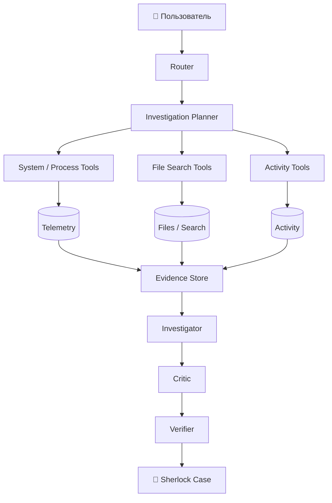
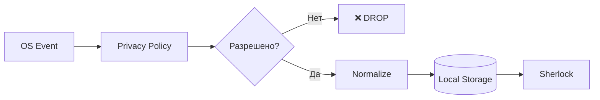

<div align="center">

# 🕵️ SherlockPC

### Компьютер, который наконец может объяснить, что с ним произошло.

**Локальная evidence-driven система расследований для персонального компьютера.**

SherlockPC собирает историю состояния системы, процессов, файлов и активности,
а затем использует ограниченный AI-reasoning, чтобы **собирать доказательства, проверять гипотезы и объяснять причины проблем**.

<br>


<br>

> ### **Спроси, что произошло. Sherlock проведёт расследование.**

</div>

---

## 🎬 Demo

<div align="center">


</div>

Пример запроса:

```text
Почему компьютер начал тормозить около 15:00?
```

Sherlock не выдаёт стандартный список из:

```text
• возможно, мало RAM
• возможно, высокая загрузка CPU
• попробуйте перезагрузить компьютер
```

Вместо этого он создаёт **Case File** — расследование с временной шкалой, доказательствами, альтернативными гипотезами и проверенным выводом.

---

# ⚡ SherlockPC за 20 секунд

SherlockPC решает три основные задачи:

|    | Сценарий        | Пример                                                    |
| -- | --------------- | --------------------------------------------------------- |
| 🔍 | **Диагностика** | `Почему компьютер сейчас тормозит?`                       |
| 📁 | **Поиск**       | `Найди PDF с моим резюме для ML-стажировки.`              |
| 🔄 | **Сравнение**   | `Что изменилось с тех пор, когда всё работало нормально?` |

Главная идея:


### Главное правило проекта

> ## **Нет доказательств → нет фактического утверждения.**

LLM может предложить гипотезу.

Но SherlockPC не должен показывать её пользователю как установленную причину, пока она не подтверждена доступными данными.

---

# Зачем нужен SherlockPC

Обычный AI-ассистент часто работает так:

```text
Вопрос
  ↓
LLM
  ↓
Правдоподобный ответ
```

Проблема в том, что **правдоподобный ответ не обязательно является правильным**.

SherlockPC использует другой подход:

```text
Вопрос
  ↓
Что именно нужно выяснить?
  ↓
Какие данные нужны?
  ↓
Что реально происходило на компьютере?
  ↓
Какие существуют гипотезы?
  ↓
Что подтверждает каждую гипотезу?
  ↓
Какие альтернативы можно исключить?
  ↓
Насколько сильны доказательства?
  ↓
Вывод
```

Цель проекта — не:

> «дать AI доступ к компьютеру».

Цель — построить локальную систему, способную ответить:

* что произошло;
* что изменилось;
* что было необычным;
* что происходило непосредственно перед проблемой;
* какие процессы или события совпали с аномалией;
* какие объяснения подтверждаются данными;
* какие альтернативные версии были проверены;
* насколько надёжен вывод;
* какое действие можно безопасно предложить пользователю.

---

# 📁 Sherlock Case Files

Центральный объект SherlockPC — не чат.

Это **дело расследования — Case File**.

Например:

```text
CASE #184
────────────────────────────────────

Вопрос
Почему компьютер начал тормозить около 15:00?

Статус
РАССЛЕДОВАНИЕ ЗАВЕРШЕНО


ОСНОВНАЯ ГИПОТЕЗА

Docker Desktop вызвал давление на память.

Уверенность
ВЫСОКАЯ


ВРЕМЕННАЯ ШКАЛА

14:31:48   Запущен Docker Desktop
14:32:11   Начался рост использования RAM
14:34:03   Обнаружена аномалия памяти
14:36:17   Swap activity выросла ×8.1
14:38:42   Снизилась отзывчивость системы


ПОДТВЕРЖДАЮЩИЕ ДАННЫЕ

E-1042   Docker memory       +5.8 GB
E-1048   RAM                 61% → 91%
E-1051   Swap activity       +710%
E-1060   Временной разрыв    23 сек


АЛЬТЕРНАТИВЫ

Chrome memory leak
ОТКЛОНЕНО
Потребление памяти Chrome оставалось стабильным.

Disk bottleneck
МАЛОВЕРОЯТНО
Задержка диска оставалась в пределах baseline.

Background update
ОТКЛОНЕНО
Подходящей активности обновлений не обнаружено.


ПРЕДЛОЖЕННОЕ ДЕЙСТВИЕ

Остановить Docker Desktop.

Ожидаемый эффект
Освободить приблизительно 5–7 GB RAM.

Риск
Запущенные контейнеры будут остановлены.
```

Таким образом:

```text
Вопрос
   ↓
Timeline
   ↓
Evidence
   ↓
Hypotheses
   ↓
Проверка альтернатив
   ↓
Verification
   ↓
Conclusion
   ↓
Safe Action
```

Расследование может завершиться не только успешным диагнозом.

Sherlock должен уметь вернуть:

```text
CONCLUDED
Причина достаточно хорошо подтверждена.

INSUFFICIENT_EVIDENCE
Недостаточно доказательств.

AMBIGUOUS
Несколько гипотез имеют сопоставимую поддержку.

NO_ANOMALY_FOUND
В указанный период аномалий не найдено.

DATA_UNAVAILABLE
Необходимые данные отсутствуют.
```

Умение сказать:

> **«Sherlock не смог достоверно установить причину».**

— является частью архитектуры, а не ошибкой системы.

---

# 🧠 Архитектура

SherlockPC разделяет:

1. **детерминированные системные возможности**;
2. **статистический / ML-анализ**;
3. **AI reasoning**.



### Reasoning-компоненты

| Компонент        | Ответственность                                      |
| ---------------- | ---------------------------------------------------- |
| **Router**       | Определяет тип запроса                               |
| **Planner**      | Решает, какие данные необходимо получить             |
| **Investigator** | Формирует и ранжирует гипотезы                       |
| **Critic**       | Ищет контрпримеры и альтернативные объяснения        |
| **Verifier**     | Проверяет groundedness и достаточность доказательств |

А такие компоненты, как:

```text
Telemetry
Processes
Filesystem
Activity
Search
```

— это **capability providers**, а не искусственные «агенты».

Например:

```python
get_cpu_usage()
```

не требует отдельного AI-агента.

---

# 🔬 Investigation Engine

Расследование представляет собой ограниченную state machine:

```text
UNDERSTAND
    ↓
PLAN
    ↓
COLLECT
    ↓
GENERATE_HYPOTHESES
    ↓
TEST
    ↓
CRITIQUE
    ↓
VERIFY
    ↓
COMPLETE
```

В отличие от бесконечного autonomous-agent loop, расследование имеет ограничения:

```text
max_tool_calls
max_investigation_rounds
time_budget
minimum_evidence_threshold
```

Это делает поведение системы:

* предсказуемее;
* дешевле;
* проще для тестирования;
* проще для отладки;
* безопаснее.

---

# ✅ Verifier

Verifier не пытается определить:

> «правильно ли думала LLM».

Вместо этого он проверяет формальные свойства результата.

Например:

```text
Есть ли evidence для каждого существенного утверждения?

Попадают ли доказательства в нужный временной интервал?

Существовал ли указанный процесс в это время?

Поддерживает ли порядок событий гипотезу?

Проверялись ли сильные альтернативные объяснения?

Есть ли данные, противоречащие выводу?

Не является ли causal wording сильнее доступных evidence?
```

Например, Sherlock не должен утверждать:

> Docker точно вызвал торможение.

если известна только временная корреляция.

Корректнее:

> Docker Desktop является наиболее вероятным объяснением. Рост его использования памяти начался за 23 секунды до появления memory pressure, а основные проверенные альтернативы не показали сопоставимых изменений.

---

# 🧾 Evidence — first-class entity

Evidence хранится как структурированная сущность, а не как текст LLM.

Например:

```json
{
  "evidence_id": "EV-1842",
  "type": "metric_change",
  "source": "system_metrics",
  "metric": "memory_usage",
  "window": {
    "start": "2026-09-08T14:30:00",
    "end": "2026-09-08T14:35:00"
  },
  "observation": {
    "before": 61.2,
    "after": 91.4,
    "unit": "%"
  },
  "baseline": {
    "expected_range": [54.0, 69.0]
  },
  "anomaly_score": 4.8,
  "reliability": "high",
  "raw_reference": "metrics:894120-894420"
}
```

Гипотеза явно ссылается на evidence:

```json
{
  "hypothesis_id": "H1",
  "statement": "Docker Desktop caused memory pressure",
  "supports": [
    "EV-1842",
    "EV-1848",
    "EV-1850"
  ],
  "contradicts": [],
  "alternatives": [
    "H2",
    "H3"
  ]
}
```

Это позволяет:

* проверять происхождение выводов;
* строить автоматический Verifier;
* находить unsupported claims;
* воспроизводить расследования;
* тестировать систему на benchmark-сценариях.

---

# 📊 Confidence без фальшивой точности

SherlockPC не должен показывать:

```text
Confidence: 94%
```

если число `94%` не было экспериментально откалибровано.

Вместо этого:

```text
УВЕРЕННОСТЬ: ВЫСОКАЯ

Почему:

✓ гипотезу поддерживают 4 независимых наблюдения
✓ временная последовательность хорошо совпадает
✓ проверены 2 сильные альтернативы
✓ противоречащих evidence не найдено
```

Внутренне можно учитывать:

```text
Evidence strength
Temporal alignment
Alternative coverage
Historical consistency
Source reliability
Contradicting evidence
```

А количественный confidence score добавить позже после калибровки на SherlockBench.

---

# 🔄 State Diff — ключевой primitive

Один из самых важных вопросов Sherlock:

> ## **Что изменилось?**

Вместо генерации случайных причин система сравнивает два состояния.

Например:

```text
State A

Последний запуск игры,
когда всё работало нормально


        VS


State B

Текущий запуск,
в котором появились проблемы
```

Результат:

```text
SystemStateDiff

Доступная RAM            -5.4 GB
Свободное место          -38.9 GB
Docker                   stopped → running
Discord                  stopped → running
GPU driver               unchanged
Game executable          unchanged
OS version               changed
Process count            +31
Background disk I/O      +184%
```

После этого Investigator решает:

> Какие из обнаруженных изменений способны объяснить наблюдаемую проблему?

Это позволяет задавать:

```text
Что изменилось со вчерашнего дня?

Что изменилось с последнего успешного запуска?

Что изменилось перед торможением?

Что изменилось после установки программы?

Почему сегодня компьютер ведёт себя иначе?
```

---

# 📈 Behavioral Baseline

Одно и то же значение метрики может означать совершенно разные вещи.

Например:

```text
RAM = 88%
```

Без контекста это почти бесполезно.

Sherlock может учитывать режим работы:

```text
Global baseline
→ необычно

Gaming baseline
→ нормально

Browsing baseline
→ крайне необычно
```

Для MVP достаточно интерпретируемых методов:

```text
Rolling Median
MAD
EWMA
Change-point Detection
```

Позже их можно сравнить с:

```text
Isolation Forest
LOF
Context-conditioned models
Autoencoder
```

Это создаёт отдельную ML-задачу:

> Насколько сложная модель обнаружения аномалий действительно улучшает диагностику по сравнению с простым статистическим baseline?

---

# 🧠 Context Engine

Sherlock не должен постоянно запускать LLM в фоне.

Исходные события:

```text
15:10 VS Code active
15:11 открыт repository sherlock-pc
15:14 изменён database.py
15:18 открыта SQLite documentation
15:27 выполнен pytest
15:31 изменён database.py
```

могут сначала обрабатываться детерминированно.

Sessionizer объединяет события с учётом:

```text
temporal proximity
project identity
file relationships
application relationships
semantic similarity
```

Результат:

```text
WorkSession #481

15:10–16:42

Проект
SherlockPC

Тема
Storage / indexing

Файлы
database.py
indexer.py
test_database.py

Приложения
VS Code
Firefox
Terminal

Действия
pytest
git diff
file edits
```

LLM может быть использована только после формирования сессии, например для короткого summary.

---

# 🧠 Recall

История активности позволяет задавать вопросы:

```text
На чём я вчера остановился?

Что я делал перед закрытием проекта?

Какой файл я редактировал последним?

Какие тесты падали?
```

Например:

```text
Последняя сессия SherlockPC

Вчера
18:21–20:04

Фокус
Retry logic файлового индексатора.

Последняя активность
Изменён:
src/indexer/retry.py

Тесты
2 failing

Связанный контекст
Issue #28
"Handle locked files gracefully"

Вероятный следующий шаг
Исправить test_retry_locked_file.
```

То есть SherlockPC постепенно становится локальным **working-memory layer** поверх операционной системы.

---

# 🔐 Privacy by Architecture

Privacy-фильтрация должна происходить **до сохранения данных**.



Главный принцип:

> ## **Исключённые данные никогда не попадают в память Sherlock.**

Например:

```text
Privacy Shield

ИСКЛЮЧЕНО
──────────────────
✓ Password managers
✓ Banking applications
✓ Incognito sessions
✓ ~/Private
✓ *.env
✓ *.key


ХРАНЕНИЕ
──────────────────
File metadata      разрешено
File contents      настраивается
Browser URLs       отключено
Terminal history   отключено
```

Privacy Policy работает **ниже AI-слоя**.

LLM не может отменить privacy rule.

---

# 🛡️ Безопасные действия

SherlockPC не должен давать LLM unrestricted shell.

AI только формирует:

```text
Action Proposal
```

Например:

```text
Предлагаемое действие
Остановить Docker Desktop

Ожидаемый эффект
Освободить ~6 GB памяти

Риск
Остановятся работающие контейнеры
```

Дальше решение принимает отдельный **Policy Engine**.

Уровни могут выглядеть так:

```text
READ
→ выполнить

LOW
→ согласно policy пользователя

MEDIUM
→ запросить подтверждение

HIGH
→ явное подтверждение пользователя
```

Даже действие:

```text
stop_process(pid)
```

должно проверить:

```text
процесс всё ещё существует

PID всё ещё принадлежит ожидаемому executable

процесс не является protected

policy разрешает действие

подтверждение пользователя относится именно
к этому action proposal
```

LLM никогда не получает unrestricted shell.

---

# ⏪ Sherlock Replay

Sherlock Replay восстанавливает состояние компьютера вокруг события.

Это **не запись экрана**.

Например:

```text
14:25 ───────────────────────────── 14:40

CPU     ▁▂▂▂▃▃▄▃▃▃▃
RAM     ▂▂▂▃▄▅▆▇████
SWAP    ▁▁▁▁▁▁▂▄▇██
DISK    ▁▂▂▂▃▃▅▅▄▃▂


14:31  Docker Desktop started

14:32  RAM anomaly

14:34  Swap activity detected

14:36  Application responsiveness degraded
```

Для выбранного момента можно показать:

```text
Processes
Files modified
Applications
Anomalies
System state
```

Главная идея:

> **observability, а не surveillance.**

---

# 🔎 Hybrid File Search

Поиск файлов не ограничивается embeddings.

Ranker может учитывать:

```text
semantic similarity
filename match
path match
extension
recency
last interaction
project affinity
time constraints
session context
```

Например:

```text
Найди PDF с резюме,
которое я отправлял прошлым летом.
```

В таком запросе:

```text
время
+
тип файла
+
история взаимодействия
```

могут оказаться важнее семантического содержимого документа.

---

# 🧪 SherlockBench

AI-диагностика должна быть **измеримой**.

Для этого проект предусматривает SherlockBench — набор контролируемых сценариев, запускаемых через тот же investigation pipeline, который используется на реальных данных.

```text
benchmarks/
└── scenarios/
    ├── memory_leak.yaml
    ├── cpu_runaway.yaml
    ├── disk_saturation.yaml
    ├── low_disk.yaml
    ├── background_update.yaml
    ├── network_saturation.yaml
    ├── normal_gaming.yaml
    ├── docker_memory.yaml
    └── chrome_memory.yaml
```

Пример:

```yaml
scenario: docker_memory_pressure

baseline:
  memory: 54
  swap: 0

events:
  - at: 120
    action: start_process
    process: docker

  - at: 140
    action: memory_growth
    process: docker
    from_mb: 900
    to_mb: 7200

  - at: 240
    action: swap_growth
    factor: 8

ground_truth:
  root_cause: docker_memory_pressure
```

### Метрики

| Метрика                    | Что измеряет                              |
| -------------------------- | ----------------------------------------- |
| **Top-1 Accuracy**         | Правильна ли главная гипотеза             |
| **Top-3 Recall**           | Попала ли причина в основные кандидаты    |
| **Detection Latency**      | Скорость обнаружения проблемы             |
| **False Alarm Rate**       | Частота ложных тревог                     |
| **Unsupported Claim Rate** | Доля утверждений без evidence             |
| **Alternative Coverage**   | Насколько хорошо проверяются альтернативы |
| **Tool Calls**             | Эффективность расследования               |
| **Token Usage**            | Стоимость reasoning                       |
| **Investigation Latency**  | Полное время расследования                |

Особенно важная метрика:

> ## **Unsupported Claim Rate**

Какой процент выводов Sherlock невозможно проследить до достаточного evidence?

Это напрямую измеряет главный принцип архитектуры.

---

# 🔬 Research Question

SherlockPC позволяет провести эксперимент:

> **Улучшает ли evidence-based multi-agent verification надёжность диагностики настолько, чтобы оправдать дополнительную вычислительную стоимость?**

Можно сравнить:

```text
Single Investigator

vs

Investigator
+ Critic

vs

Investigator
+ Critic
+ Verifier
```

по:

```text
Top-1 Accuracy
Top-3 Recall
False Positives
Unsupported Claims
Alternative Coverage
Tool Calls
Latency
Token Cost
```

Таким образом SherlockPC — не только desktop-приложение, но и полноценный AI/ML + Systems research project.

---

# 🧰 Планируемый стек

## Desktop

```text
Tauri 2
React
TypeScript
```

## Intelligence Backend

```text
Python
Pydantic
asyncio
Local IPC / API Layer
```

## Storage

```text
SQLite
Polars
```

Для первой версии отдельная time-series database не требуется.

SQLite может хранить:

```text
events
process samples
aggregated metrics
files
sessions
cases
evidence
hypotheses
```

## Vector Search

Vector storage скрывается за интерфейсом:

```python
class VectorStore:
    def add(self, ...):
        ...

    def search(self, ...):
        ...

    def delete(self, ...):
        ...
```

Конкретную реализацию можно менять без изменения Investigation Engine.

## LLM

```text
LLMProvider
├── LocalProvider
├── OpenAIProvider
└── ...
```

Sherlock не должен зависеть от конкретной модели.

Предпочтительное направление проекта — **local-first inference**.

---

# ⚙️ Background Service

Фоновый Sherlock не должен постоянно использовать LLM.

В фоне выполняются:

```text
collect
normalize
aggregate
index
detect
```

Например:

```text
CPU metrics      deterministic
process events   deterministic
file events      deterministic
anomalies        statistical
sessions         clustering / rules
embeddings       batch / on-change
```

LLM включается, когда:

```text
пользователь задаёт вопрос

или

необходимо создать context summary

или

запускается явно разрешённое расследование
```

---

# 🗃️ Data Model

Упрощённая модель:

```text
system_metrics
──────────────
timestamp
cpu
memory
swap
disk_read
disk_write
network_rx
network_tx
gpu
temperature


process_events
──────────────
timestamp
pid
process
event_type
metadata


process_samples
───────────────
timestamp
pid
cpu
memory
disk_io
network


files
─────
id
path
filename
extension
size
created_at
modified_at
content_hash
semantic_summary
privacy_class


file_chunks
───────────
id
file_id
chunk_index
text
embedding


activity_events
───────────────
timestamp
type
application
resource
metadata


sessions
────────
id
start_time
end_time
project
topic
summary
embedding


cases
─────
id
question
created_at
intent
status
conclusion
confidence_level


evidence
────────
id
case_id
type
source
timestamp
payload
reliability


hypotheses
──────────
id
case_id
statement
status
rank


hypothesis_evidence
───────────────────
hypothesis_id
evidence_id
relation


action_proposals
────────────────
id
case_id
action
risk
expected_effect
status
```

---

# 📂 Структура репозитория

```text
sherlockpc/
│
├── apps/
│   └── desktop/
│
├── sherlock/
│   ├── investigation/
│   │   ├── router/
│   │   ├── planner/
│   │   ├── investigator/
│   │   ├── critic/
│   │   └── verifier/
│   │
│   ├── capabilities/
│   │   ├── telemetry/
│   │   ├── processes/
│   │   ├── filesystem/
│   │   └── activity/
│   │
│   ├── intelligence/
│   │   ├── anomalies/
│   │   ├── baseline/
│   │   ├── retrieval/
│   │   ├── ranking/
│   │   ├── sessionization/
│   │   └── embeddings/
│   │
│   ├── storage/
│   │   ├── sqlite/
│   │   └── vectors/
│   │
│   ├── platform/
│   │   ├── base.py
│   │   └── windows/
│   │
│   ├── permissions/
│   │   ├── policy.py
│   │   ├── proposals.py
│   │   └── audit.py
│   │
│   └── providers/
│       └── llm/
│
├── simulator/
│   ├── scenarios/
│   └── workloads/
│
├── benchmarks/
│
├── tests/
│
└── docs/
    ├── architecture.md
    ├── privacy.md
    ├── evidence-model.md
    └── threat-model.md
```

---

# 🖥️ Platform Strategy

Архитектура остаётся потенциально cross-platform:

```python
class PlatformAdapter:
    def get_processes(self):
        ...

    def get_active_application(self):
        ...

    def get_system_metrics(self):
        ...

    def watch_files(self):
        ...

    def get_application_events(self):
        ...
```

Но MVP намеренно:

> ## **Windows-first**

План:

```text
WindowsAdapter     ← MVP
LinuxAdapter       ← later
MacOSAdapter       ← later
```

Одна хорошо поддерживаемая платформа полезнее трёх полуработающих.

---

# 🚀 MVP

SherlockPC `0.1` должен доказать три основные идеи.

## 1. Diagnose

```text
Почему компьютер тормозит?
```

Необходимо:

```text
Telemetry
+
Process History
+
Anomaly Detection
+
Evidence
+
Investigation
```

---

## 2. Search

```text
Найди PDF с моим ML internship CV.
```

Необходимо:

```text
File Index
+
Semantic Retrieval
+
Hybrid Ranking
```

---

## 3. Compare

```text
Что изменилось со вчерашнего дня?
```

Необходимо:

```text
State Snapshots
+
State Diff
```

Если эти три сценария работают хорошо, основной thesis SherlockPC уже доказан.

---

# 🗺️ Roadmap

## `v0.1` — Observe & Investigate

* [ ] Windows telemetry collector
* [ ] Process history
* [ ] SQLite event storage
* [ ] Behavioral baseline
* [ ] Basic anomaly detection
* [ ] Evidence model
* [ ] Investigation state machine
* [ ] Investigator
* [ ] Critic
* [ ] Verifier
* [ ] Sherlock Case Files
* [ ] State Diff
* [ ] File indexing
* [ ] Hybrid file retrieval
* [ ] SherlockBench MVP

## `v0.2` — Remember

* [ ] Activity timeline
* [ ] Sessionization
* [ ] Project context
* [ ] Work session summaries
* [ ] Recall queries
* [ ] Sherlock Replay
* [ ] Расширенный SherlockBench

## `v0.3` — Act

* [ ] Action proposals
* [ ] Policy Engine
* [ ] Confirmation flows
* [ ] Safe executors
* [ ] Audit log

## Позже

* [ ] Linux Adapter
* [ ] macOS Adapter
* [ ] Learned retrieval ranker
* [ ] Context-conditioned anomaly models
* [ ] Confidence calibration
* [ ] Расширенный benchmark
* [ ] Дополнительные LLM providers

---

# 🔍 Investigation Trace

Sherlock должен показывать пользователю, **что было проверено**, но не скрытый chain-of-thought модели.

Например:

```text
INVESTIGATION TRACE

✓ Определён временной диапазон
✓ Загружена история memory usage
✓ Найдена аномалия в 09:18
✓ Проверены процессы, запущенные ±5 минут
✓ Обнаружен Docker Desktop
✓ Сравнён рост памяти процессов
✓ Проверена гипотеза disk bottleneck
✓ Проверена гипотеза Chrome memory leak
✓ Проверены ссылки на evidence
```

Trace показывает:

```text
actions
tools
observations
evidence
tests
verification results
```

а не внутренние рассуждения модели.

Это одновременно улучшает:

```text
observability
debugging
trust
UX
```

---

# 🧩 Пять уровней SherlockPC

Всю систему можно представить как пять слоёв:

```text
                 SHERLOCKPC
                      │
──────────────────────┼──────────────────────


1. OBSERVE

Telemetry
Processes
Files
Activity

                      ↓


2. REMEMBER

Event Timeline
File Index
Work Sessions
State Snapshots

                      ↓


3. UNDERSTAND

Semantic Retrieval
Behavioral Baseline
Anomaly Detection
State Diff

                      ↓


4. INVESTIGATE

Planner
Hypotheses
Evidence
Critic
Verifier

                      ↓


5. ACT

Action Proposal
Policy
Confirmation
Executor
Audit
```

---

# ❌ Non-goals

SherlockPC сознательно **не пытается** быть:

* антивирусом;
* основной системой malware detection;
* screen recorder;
* unrestricted autonomous desktop agent;
* системой, объявляющей causality только из временной корреляции;
* инструментом, индексирующим приватные переписки по умолчанию;
* shell, которым напрямую управляет LLM;
* системой из 20 искусственных «агентов»;
* собственной vector database;
* проектом с нейросетевой anomaly detection только ради слова AI;
* одновременно полноценным Windows/Linux/macOS-приложением на этапе MVP.

---

# 🎓 Research / Diploma Direction

Исследовательское позиционирование проекта:

> **Evidence-Based Agent Diagnosis for Personal Computing Environments**

Главный исследовательский вопрос:

> **Повышает ли evidence-based multi-agent verification надёжность компьютерной диагностики достаточно сильно, чтобы оправдать дополнительную вычислительную стоимость?**

SherlockBench позволяет ответить на этот вопрос количественно, а не субъективно.

---

# 💡 В одной фразе

> **SherlockPC — локальная evidence-driven система расследований, которая строит структурированную историю компьютера и использует ограниченный AI-reasoning, чтобы объяснять, что произошло, что изменилось и что наиболее вероятно вызвало проблему.**

Или ещё короче:

<div align="center">

## 🕵️ **Компьютер, который наконец может объяснить себя.**

**Ask what happened. Sherlock investigates.**

</div>

---

# Почему этот проект существует

Персональный компьютер постоянно генерирует огромное количество полезной информации:

```text
что было запущено

что изменилось

что было необычным

что происходило рядом по времени

какие файлы изменялись

какие приложения использовались

как менялись ресурсы системы
```

Но эти данные разбросаны между:

```text
логами
мониторингом
filesystem
process table
event history
application state
```

и практически никогда не объединяются в понятную пользователю историю.

SherlockPC исследует другую идею:

> **Что, если у персонального компьютера появится локальный слой памяти и доказательств, способный расследовать собственную историю?**

Самое интересное здесь — не подключить LLM к системным API.

Самое интересное — построить систему, в которой AI-выводы являются:

* **проверяемыми**;
* **прослеживаемыми до evidence**;
* **опровержимыми**;
* **privacy-aware**;
* **воспроизводимыми**;
* **измеримыми**.

<div align="center">

### **Это и есть SherlockPC.**

</div>
