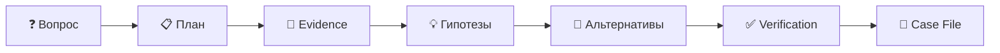

<div align="center">

# 🕵️ SherlockPC

### Компьютер, который наконец может объяснить, что с ним произошло.

**Локальная evidence-driven система расследований для персонального компьютера.**


> **Спроси, что произошло. Sherlock проведёт расследование.**

</div>

---

## 🎬 Demo

<div align="center">

</div>

> Демо выше — UI-концепт текущего MVP, а не запись готовой production-версии.

## ⚡ За 20 секунд

| Сценарий | Пример |
|---|---|
| 🔍 **Диагностика** | `Почему компьютер сейчас тормозит?` |
| 📁 **Поиск** | `Найди PDF с моим резюме для ML-стажировки.` |
| 🔄 **Сравнение** | `Что изменилось с тех пор, когда всё работало нормально?` |



> ## **Нет доказательств → нет фактического утверждения.**

LLM может предложить гипотезу, но SherlockPC не должен показывать её как установленную причину, пока она не подтверждена доступными данными.

---

## Как выглядит расследование

```text
CASE #184
────────────────────────────────

Вопрос
Почему компьютер начал тормозить около 15:00?

Основная гипотеза
Docker Desktop вызвал давление на память.

Уверенность
ВЫСОКАЯ

Timeline
14:31:48   Docker Desktop started
14:32:11   RAM usage began increasing
14:34:03   Memory anomaly detected
14:36:17   Swap activity ×8.1

Evidence
E-1042   Docker memory +5.8 GB
E-1048   RAM 61% → 91%
E-1051   Swap activity +710%

Alternatives
Chrome memory leak  → REJECTED
Disk bottleneck     → UNLIKELY

Suggested action
Stop Docker Desktop

Risk
Running containers will stop.
```

---

## Архитектура


Sherlock отделяет deterministic capabilities от AI reasoning:

- **Router** — определяет тип расследования;
- **Planner** — выбирает необходимые данные;
- **Investigator** — формирует гипотезы;
- **Critic** — ищет альтернативы и контрпримеры;
- **Verifier** — проверяет evidence и groundedness.

Подробно: **[docs/architecture.md](docs/architecture.md)**

---

## Privacy by Architecture


> **Исключённые данные никогда не попадают в память Sherlock.**

Privacy Policy применяется **до сохранения**, а LLM не получает unrestricted shell.

Подробно: **[docs/threat-model.md](docs/threat-model.md)**

---

## MVP

### Diagnose
`Почему компьютер тормозит?`

Telemetry + processes + anomaly detection + evidence-backed investigation.

### Search
`Найди PDF с моим ML internship CV.`

File index + hybrid semantic retrieval.

### Compare
`Что изменилось со вчерашнего дня?`

State snapshots + State Diff.

---

## SherlockBench

SherlockBench прогоняет контролируемые сценарии через тот же investigation pipeline.

Основные метрики:

- Top-1 Accuracy;
- Top-3 Recall;
- False Alarm Rate;
- Unsupported Claim Rate;
- Detection Latency;
- Alternative Coverage;
- Tool Calls;
- Token Usage.

Исследовательский вопрос:

> **Повышает ли evidence-based multi-agent verification надёжность диагностики настолько, чтобы оправдать дополнительную вычислительную стоимость?**

---

## Планируемый стек

```text
Desktop       Tauri 2 + React + TypeScript
Backend       Python + Pydantic + asyncio
Storage       SQLite + Polars
Vector        provider abstraction
LLM           local-first provider abstraction
Platform      Windows-first MVP
```

---

## Roadmap

### v0.1 — Observe & Investigate
- [ ] Windows telemetry collector
- [ ] Process history
- [ ] SQLite event storage
- [ ] Behavioral baseline
- [ ] Evidence model
- [ ] Investigation state machine
- [ ] Investigator / Critic / Verifier
- [ ] State Diff
- [ ] File indexing
- [ ] SherlockBench MVP

### v0.2 — Remember
- [ ] Activity timeline
- [ ] Sessionization
- [ ] Recall
- [ ] Sherlock Replay

### v0.3 — Act
- [ ] Action Proposals
- [ ] Policy Engine
- [ ] Confirmation flow
- [ ] Safe Executor
- [ ] Audit Log

---

## Документация

- **[Architecture](docs/architecture.md)** — компоненты, data flow, evidence model и Investigation Engine.
- **[Threat Model](docs/threat-model.md)** — privacy zones, trust boundaries, prompt injection и safe actions.
- **[Demo](docs/assets/demo.gif)** — короткий UI-концепт расследования.

---

<div align="center">

## 🕵️ Компьютер, который наконец может объяснить себя.

**Ask what happened. Sherlock investigates.**

</div>
