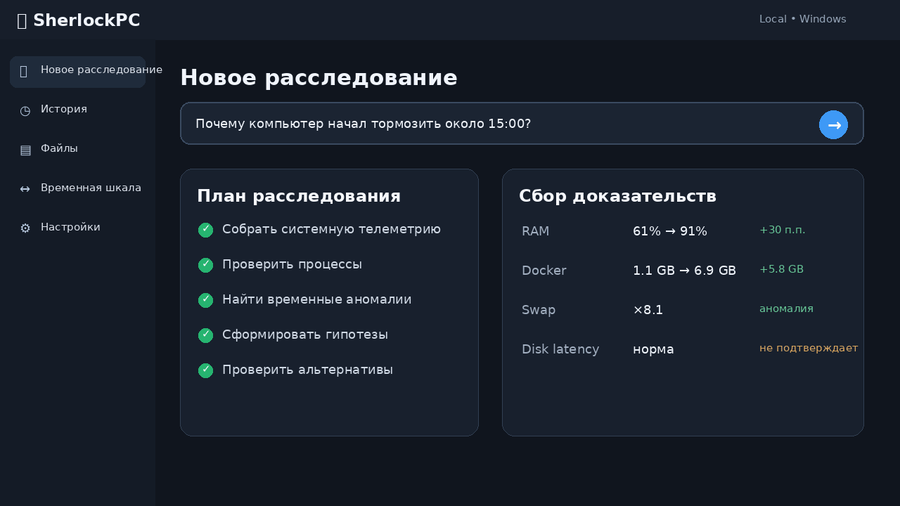
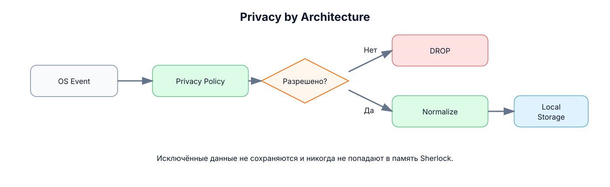
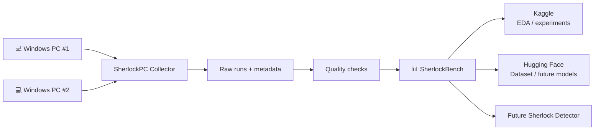
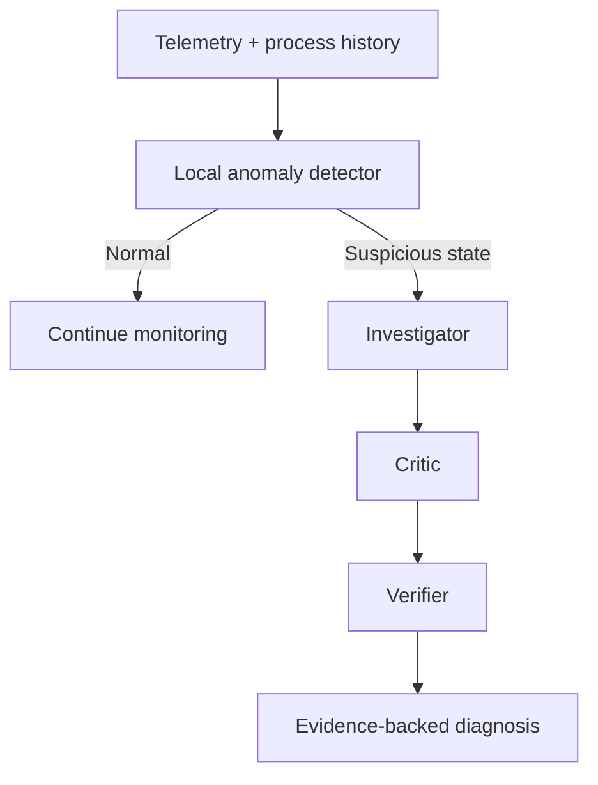

<div align="center">

# 🕵️ SherlockPC

### Компьютер, который наконец может объяснить, что с ним произошло.

**Local-first, evidence-driven система расследований для персонального компьютера.**

[](https://github.com/fireaideveloper/SherlockPC)
[](https://www.python.org/)
[](https://github.com/fireaideveloper/SherlockPC)
[](https://github.com/fireaideveloper/SherlockPC)
[](docs/architecture.md)
[](https://huggingface.co/datasets/fireaideveloper/SherlockBench)
[](https://www.kaggle.com/fireaideveloper)

> **Ask what happened. Sherlock investigates.**

[GitHub](https://github.com/fireaideveloper/SherlockPC) ·
[Hugging Face](https://huggingface.co/datasets/fireaideveloper/SherlockBench) ·
[Kaggle](https://www.kaggle.com/fireaideveloper)

</div>

---

## 🎬 Demo

<div align="center">

</div>

> Демо выше — UI-концепт целевого desktop-интерфейса. Текущая версия проекта сосредоточена на telemetry, evidence layer, state comparison и SherlockBench.

---

## ⚡ SherlockPC за 20 секунд

SherlockPC — это не ещё один чат поверх LLM. Пользователь описывает проблему обычным языком, а система должна сама определить, **какие данные проверить, какие гипотезы сравнить и достаточно ли доказательств для вывода**.

| Режим | Пример запроса |
|---|---|
| 🔍 **Diagnose** | `Почему компьютер начал тормозить?` |
| 📁 **Search** | `Найди презентацию про ML, которую я редактировал летом.` |
| 🧠 **Recall** | `На чём я остановился вчера в SherlockPC?` |
| 🔄 **Compare** | `Что изменилось с тех пор, когда всё работало нормально?` |


> ### Нет доказательств → нет фактического утверждения.
>
> LLM может предложить гипотезу, но SherlockPC не должен показывать её как установленную причину, пока она не подтверждена доступными данными.

---

## 🚧 Текущее состояние

Проект находится в активной разработке. На текущем этапе уже реализован фундамент, на котором позже будет работать investigation engine.

### Реализовано

- ✅ сбор системной telemetry;
- ✅ snapshots процессов и process history;
- ✅ SQLite storage layer;
- ✅ behavioral baseline по историческим наблюдениям;
- ✅ structured evidence model;
- ✅ State Diff между сохранёнными состояниями;
- ✅ controlled workload recorder и scenario batches;
- ✅ SherlockBench MVP;
- ✅ локальный индекс файлов: выбранные папки, исключения, метаданные и поиск по UTF-8 тексту;
- ✅ автоматические тесты — **217 passed** (Linux, Python 3.12, шаг 1.10).
- ✅ bounded Investigation Engine MVP: Case Report, trace и evidence references.
- ✅ Investigator / Critic / Verifier MVP: до трёх ресурсных гипотез, альтернативы и проверка evidence; причинность не подтверждается.

### Следующий слой

- 🚧 расширение Investigation Engine: гипотезы и проверка причин;
- 🚧 проверка причин по динамике процессов и дополнительным измерениям;
- 🚧 anomaly detection experiments на SherlockBench;
- 🚧 извлечение PDF/DOCX и semantic/hybrid retrieval;
- 🚧 desktop UI;
- 🚧 локальная ML-модель для обнаружения подозрительных состояний.

---

## 🔬 Как должно выглядеть расследование

```text
CASE #184
────────────────────────────────

Question
Почему компьютер начал тормозить около 15:00?

Main hypothesis
Docker Desktop вызвал давление на память.

Confidence
HIGH

Timeline
14:31:48   Docker Desktop started
14:32:11   RAM usage began increasing
14:34:03   Memory anomaly detected
14:36:17   Swap activity ×8.1

Evidence
E-1042   Docker memory +5.8 GB
E-1048   RAM 61% → 91%
E-1051   Swap activity +710%

Alternatives
Chrome memory leak  → REJECTED
Disk bottleneck     → UNLIKELY

Suggested action
Stop Docker Desktop

Risk
Running containers will stop.
```

Это **целевой формат Investigation Engine**, а не утверждение о том, что весь pipeline уже реализован в текущей версии.

---

## 🧩 Архитектура


SherlockPC разделяет deterministic system capabilities и AI reasoning:

- **Intent Router** — определяет тип запроса и необходимые capabilities;
- **Orchestrator / Planner** — решает, какие данные нужно получить;
- **System & Process capabilities** — собирают реальные наблюдения;
- **Investigator** — строит гипотезы на основе evidence;
- **Critic** — ищет альтернативные объяснения и контрпримеры;
- **Verifier** — проверяет достаточность доказательств и groundedness ответа.

Подробно: **[docs/architecture.md](docs/architecture.md)**

---

## 🔐 Privacy by Architecture



> **Исключённые данные не должны попадать в память Sherlock.**

Основные принципы:

- local-first обработка;
- минимизация собираемых данных;
- privacy zones для файлов и приложений;
- policy layer перед потенциально опасными действиями;
- отсутствие unrestricted shell-доступа у LLM;
- cloud intelligence — только как отдельный opt-in режим в будущем.

Подробно: **[docs/threat-model.md](docs/threat-model.md)**

---

## 📊 SherlockBench

**SherlockBench** — собственный датасет и экспериментальная среда SherlockPC для controlled Windows workloads и будущей оценки anomaly detection / diagnosis pipeline.

### Release v0.3.0

| Параметр | Значение |
|---|---:|
| Primary observations | **960** |
| Accepted experiments | **16** |
| Duration per experiment | **5 min** |
| Windows PCs | **2** |
| Scenarios | **4** |

Сценарии:

- `normal`
- `cpu_load`
- `memory_growth`
- `mixed`

Каждый основной эксперимент содержит фазы **baseline → active → recovery**. Реальные измерения сохраняются без искусственного дополнения пропущенных строк.

### Где опубликован

- 🤗 **Hugging Face Dataset:** [fireaideveloper/SherlockBench](https://huggingface.co/datasets/fireaideveloper/SherlockBench)
- 📊 **Kaggle:** [fireaideveloper](https://www.kaggle.com/fireaideveloper)
- 💻 **Source / Collector:** этот репозиторий



### Исследовательское направление

По мере роста датасета планируется сравнивать:

- rolling statistics / z-score;
- Isolation Forest;
- Local Outlier Factor;
- change-point detection;
- supervised workload / anomaly classifiers;
- single-agent и multi-agent diagnosis pipelines.

Будущие метрики:

- Top-1 root-cause accuracy;
- Top-3 root-cause recall;
- False Alarm Rate;
- Detection Latency;
- Unsupported Claim Rate;
- Alternative Coverage;
- Tool Calls;
- Token Usage.

Исследовательский вопрос:

> **Повышает ли evidence-based multi-agent verification надёжность диагностики настолько, чтобы оправдать дополнительную вычислительную стоимость?**

---

## 🧠 Планируемый intelligence layer

SherlockPC не должен постоянно отправлять всю telemetry в большую LLM. Планируемая схема — дешёвый локальный detection layer + более глубокое расследование только при необходимости.



---

## 🛠 Стек

### Уже используется

```text
Core          Python 3.11+
System data   psutil
Storage       SQLite
Validation    structured Python models
Testing       pytest
```

### Планируется

```text
Desktop       Tauri 2 + React + TypeScript
Analytics     Polars / NumPy / scikit-learn
Vector        FAISS or SQLite vector extension
Embeddings    sentence-transformers
Local LLM     provider abstraction / Ollama
ML            scikit-learn + time-series methods
```

---

## 🗺 Roadmap

### v0.1 — Observe & Investigate

- [x] Windows telemetry collector
- [x] Process history
- [x] SQLite event storage
- [x] Behavioral baseline
- [x] Anomaly Detection MVP — пороговый отчёт CPU/RAM/swap
- [x] Evidence model
- [x] Investigation state machine MVP — фиксированный проход по сохранённому состоянию
- [x] Investigator / Critic / Verifier MVP — гипотезы по CPU/RAM/swap, критика и проверка сигналов
- [x] State Diff
- [x] File indexing MVP — метаданные, опциональный UTF-8 текст и буквальный поиск
- [x] SherlockBench MVP

### v0.2 — Remember

- [ ] Activity timeline
- [ ] Sessionization
- [ ] Recall
- [ ] Sherlock Replay

### v0.3 — Act

- [ ] Action Proposals
- [ ] Policy Engine
- [ ] Confirmation flow
- [ ] Safe Executor
- [ ] Audit Log

---

## 📚 Документация

- **[Architecture](docs/architecture.md)** — компоненты, data flow, evidence model и Investigation Engine.
- **[Threat Model](docs/threat-model.md)** — privacy zones, trust boundaries, prompt injection и safe actions.
- **[Demo](docs/assets/demo.gif)** — UI-концепт SherlockPC.
- **[SherlockBench on Hugging Face](https://huggingface.co/datasets/fireaideveloper/SherlockBench)** — опубликованный dataset.
- **[Kaggle profile](https://www.kaggle.com/fireaideveloper)** — dataset, EDA и эксперименты.

---

## 🎯 Цель проекта

SherlockPC создаётся как research pet project на пересечении:

**Machine Learning · Time Series · Anomaly Detection · Multi-Agent Systems · Local AI · System Engineering**

Цель — построить систему, которая не просто генерирует правдоподобный ответ о состоянии ПК, а умеет **собирать evidence, проверять альтернативы и явно показывать, почему она пришла к выводу**.

---

<div align="center">

## 🕵️ Компьютер, который наконец может объяснить себя.

**Ask what happened. Sherlock investigates.**

[GitHub](https://github.com/fireaideveloper/SherlockPC) ·
[Hugging Face](https://huggingface.co/datasets/fireaideveloper/SherlockBench) ·
[Kaggle](https://www.kaggle.com/fireaideveloper)

</div>

### Шаг 1.7 — обнаружение аномалий

Команда: `python -m sherlock.anomalies --state <ID>`.
Отчёт различает отклонения, отсутствие отклонений и недостаточную историю.
[Установка, правила, проверка и ограничения](docs/step-1.7-anomalies.md).

### Шаг 1.8 — Investigation Engine MVP

`python -m sherlock.investigate --state 42` формирует Case Report по сохранённому снимку: статус, отклонения, ссылки на evidence и trace. SQLite открывается read-only. Причины тормозов и процессы-виновники пока не определяются.

[Файлы, установка, устройство и проверка](docs/step-1.8-investigation.md).

### Шаг 1.9 — Investigator / Critic / Verifier MVP

Та же команда `python -m sherlock.investigate --state 42` теперь выдаёт гипотезы, критику и вердикты. Относительные отклонения отделены от абсолютных сигналов нагрузки. Подтверждённый сигнал не означает установленную причину тормозов.

[Установка, правила, статусы и ограничения](docs/step-1.9-reasoning.md).

### Шаг 1.10 — File indexing MVP

```powershell
python -m sherlock.files index .\docs --text
python -m sherlock.files search "baseline"
```

Индекс локальный: `data/files.db`. По умолчанию сохраняются только метаданные; `--text` разрешает содержимое небольших UTF-8 TXT/MD/RST/CSV/TSV. PDF/DOCX доступны по имени и пути. Исключения приватных путей сохраняются между сканированиями. Нет OCR, embeddings или семантического поиска.

[Установка и ограничения](docs/step-1.10-file-indexing.md) · [Итог первого MVP v0.1](docs/v0.1-summary.md).

Все десять пунктов исходного списка v0.1 реализованы в ограниченном MVP. Проверка причин, калибровка на реальных данных и полноценный desktop-интерфейс остаются дальнейшим развитием.
