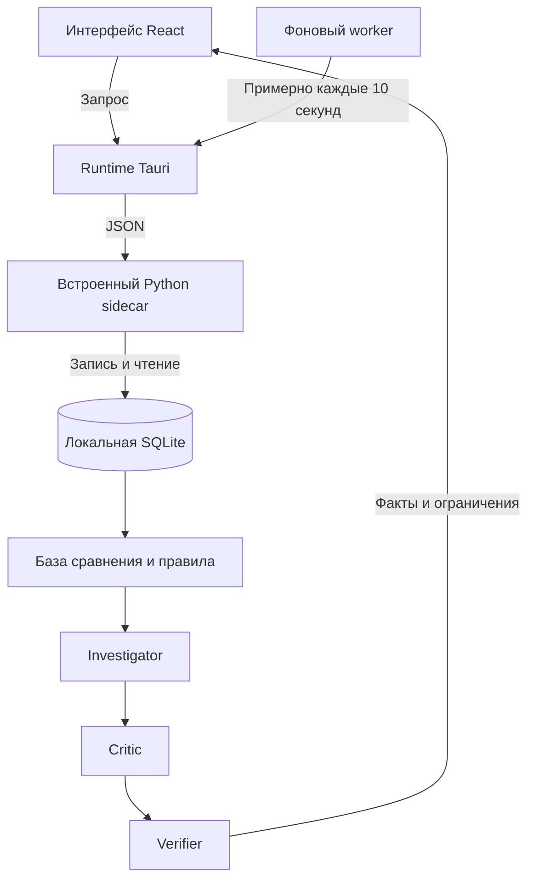
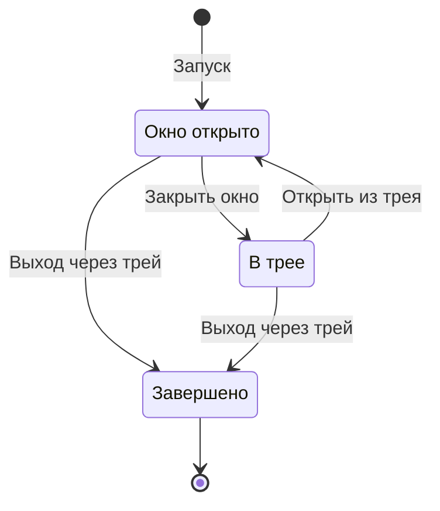

# SherlockPC


[English](README.md) · **Русский** · [Документация](docs/README.md) · [Скачать релиз](https://github.com/fireaideveloper/SherlockPC/releases) · [Сообщить об ошибке](https://github.com/fireaideveloper/SherlockPC/issues)

**Понять нагрузку. Проверить факты. Сохранить историю.**

SherlockPC — локальное Windows-приложение, которое сохраняет системные и процессные измерения и проверяет CPU, RAM и подкачку относительно истории. Отчёт связывает наблюдения и ограниченные гипотезы с доказательствами и показывает границы выводов.

**v0.1 · Выпущенный релиз · Windows x64 · Локальная обработка · 12 языков интерфейса**

Публичная версия — [0.1](VERSION); техническая версия npm, Cargo и Tauri — `0.1.0`. Эта инструкция описывает выпущенную версию. Архитектурные документы также содержат будущие планы.

## Содержание

[С чего начать](#с-чего-начать) · [Возможности](#возможности) · [Как пользоваться](#как-пользоваться) · [Как это работает](#как-это-работает) · [Языки](#языки) · [Данные и приватность](#данные-и-приватность) · [Разработка](#разработка) · [Карта проекта](#карта-проекта) · [Решение проблем](#решение-проблем) · [Ограничения](#ограничения) · [Ссылки и лицензии](#ссылки-и-лицензии)

## С чего начать

| Задача | Куда перейти |
|---|---|
| Установить приложение | [Установщики релиза](https://github.com/fireaideveloper/SherlockPC/releases), затем [инструкция](#как-пользоваться) |
| Читать на английском | [English README](README.md) |
| Узнать изменения v0.1 | [Заметки к релизу](RELEASE_NOTES_v0.1.md) |
| Запустить или собрать исходники | [Desktop guide](docs/desktop.md) |
| Найти конкретный файл | [Карта проекта](#карта-проекта) и [полный указатель файлов](docs/files.md) |
| Изучить дальнейшую архитектуру | [Архитектура](docs/architecture.md) и [модель угроз](docs/threat-model.md) — проектные документы |
| Использовать Python-инструменты | [CLI guide](docs/cli.md) |

Скачайте **`SherlockPC-v0.1-Setup.exe`** со страницы релизов, установите и откройте приложение. Backend входит в установщик; пользователю не нужны Python, Node.js и Rust. ZIP с исходниками предназначен для разработки и не содержит установщика.

Если в релизе есть `SHA256SUMS.txt`, сравните его значение с результатом PowerShell из папки загрузок:

```powershell
Get-FileHash .\SherlockPC-v0.1-Setup.exe -Algorithm SHA256
```

## Возможности

| Возможность | Что доступно в v0.1 |
|---|---|
| Обзор состояния | CPU, RAM, подкачка, число процессов и последние замеры |
| Автоматическая история | Native worker стремится снимать состояние примерно каждые 10 секунд |
| Ограниченное расследование | База сравнения, наблюдения, гипотезы, ссылки на факты и проверка выводов |
| Просмотр истории | Постраничные замеры, расположение базы и очистка с подтверждением |
| Фоновая работа | Крестик скрывает окно в трей; сбор продолжается |
| Автозапуск Windows | Запуск в фоне при входе пользователя в систему |
| Оформление и локализация | Светлая, тёмная и системная темы; 12 языков; сохранение настроек |
| Инструменты разработчика | State Diff, индексация/поиск файлов и эксперименты через Python |

## Как пользоваться

1. Выберите язык справа вверху, тему — в «Настройках».
2. Оставьте приложение работать для накопления истории. Нужны **и число замеров, и период наблюдения**. По умолчанию — 30 исторических замеров и период 300 секунд; прогресс виден в интерфейсе.
3. Нажмите «Проверить CPU» или «Проверить память» либо введите вопрос как подпись к проверке.
4. Нажмите «Проверить» и откройте «Расследование»: изучите наблюдения, доказательства, ход проверки и ограничения.
5. Смотрите замеры в «Истории». При необходимости включите автозапуск при входе в Windows в «Настройках».

| Раздел или кнопка | Назначение |
|---|---|
| Обзор | Последнее состояние, недавняя нагрузка и готовность базы сравнения |
| Снять замер / Refresh state | Сохраняет новое состояние; не запускает расследование заново |
| Проверить CPU / Проверить память | Подставляет вопрос; оба варианта проверяют все правила CPU/RAM/swap |
| Проверить / Investigate | Создаёт отчёт, который остаётся неизменным до следующей проверки |
| История / Обновить список | Просмотр и обновление списка сохранённых состояний |
| Открыть папку / Расположение истории | Открывает реальную папку `sherlock.db` |
| Очистить все состояния | После подтверждения удаляет состояния и связанные измерения; сбор начинает новую историю |
| Настройки | Тема, автозапуск и управление историей |
| Крестик окна | Скрывает приложение в трей; сбор продолжается |
| Трей: Выход — остановить сбор | Завершает приложение и прекращает сбор |

**Как понимать результат:** накопление истории означает недостаток данных для сравнения. Найденные сигналы — отклонения по правилам. Отсутствие отклонений означает только отсутствие подтверждённых сигналов по этим правилам. Готовность базы сравнения **не является оценкой здоровья ПК**.

## Как это работает

Desktop использует детерминированные Python-проверки. LLM и облачный API не требуются.



Rust runtime продолжает работу в трее. Backend запускается отдельным **одноразовым sidecar на каждый запрос**. Общая блокировка фонового и ручного сбора не позволяет старому ответу заменить более свежий замер.



Сбор работает и при открытом окне, и в трее. Подробнее: [desktop guide](docs/desktop.md), [исходные файлы](docs/files.md).

## Языки

| Код | Язык интерфейса | Код | Язык интерфейса |
|---|---|---|---|
| `en` | English | `fr` | Français |
| `ru` | Русский | `it` | Italiano |
| `es` | Español | `de` | Deutsch |
| `pt-BR` | Português (Brasil) | `ja` | 日本語 |
| `zh-CN` | 简体中文 | `ko` | 한국어 |
| `ar` | العربية | `hi` | हिन्दी |

Переключение работает без перезапуска. Начальный язык определяется системой, запасной — английский. Даты, числа и длительности локализованы; арабский поддерживает RTL. Шрифты Noto входят в сборку для работы офлайн. Технические ID, имена процессов, пути и исходные ошибки не переводятся.

[Каталоги переводов](desktop/src/locales) · [Выбор языка](desktop/src/i18n.ts) · [Текст отчётов](desktop/src/reportText.ts) · [Лицензии шрифтов](licenses).

## Данные и приватность

Сбор и диагностика выполняются локально. Установленная Windows-версия использует:

```text
%LOCALAPPDATA%\SherlockPC\data\sherlock.db
```

Точный путь виден в «Истории» и «Настройках». Для разработки и тестов доступна переменная `SHERLOCK_DB_PATH`. Отдельные CLI-инструменты могут использовать другие базы; см. [CLI guide](docs/cli.md).

Для резервной копии завершите приложение через трей и скопируйте **всю папку данных**. Очистка состояний необратима и требует подтверждения; после неё начинается новая история. Метаданные процессов и пути могут содержать личную информацию: не включайте личную базу в публичные архивы.

[Модель угроз](docs/threat-model.md) описывает более широкие цели безопасности, а не подтверждает реализацию всех запланированных защит в v0.1.

## Разработка

Команды выполняются из корня проекта, если не указано иначе.

| Требование | Для разработчика |
|---|---|
| ОС для релизной сборки | Windows x64 |
| Python | 64-bit Python 3.11+; Windows CI использует 3.12 |
| Node.js | 22.12+; Windows CI использует Node 24 |
| Rust | Stable MSVC, `x86_64-pc-windows-msvc` |
| Native-инструменты | Visual Studio Build Tools с C++ и Windows SDK |
| Desktop runtime | WebView2 Runtime |

Запуск разработки:

```bat
RUN_DESKTOP_DEV.cmd
```

Сборка backend, проверки исходников, Tauri/NSIS и подготовка релиза:

```bat
BUILD_DESKTOP_WINDOWS.cmd
```

После успешной сборки в `release/` находятся `SherlockPC-v0.1-Setup.exe`, `SHA256SUMS.txt` и `RELEASE_NOTES.md`. Native EXE: `desktop/src-tauri/target/release/sherlockpc.exe`. Пользователям распространяйте установщик, включающий backend. [Подробности сборки](docs/desktop.md).

### Проверки исходников

```bash
python -m pip install -e ".[dev]"
python -m pytest -q
cd desktop
npm ci
npm run check
npm test
npm run build
npx playwright install chromium
npm run test:ui
```

Тесты Python bridge проверяют CP1251, CP1252 и ASCII. Браузерные UI-тесты используют имитацию IPC и не меняют личную историю. Трей, автозапуск и установщик проверяются отдельно на Windows.

## Карта проекта

| Область | Основные файлы | Назначение |
|---|---|---|
| Интерфейс | [App.tsx](desktop/src/App.tsx), [styles.css](desktop/src/styles.css), [api.ts](desktop/src/api.ts) | Экраны, оформление и native-вызовы |
| Локализация | [i18n.ts](desktop/src/i18n.ts), [каталоги](desktop/src/locales), [reportText.ts](desktop/src/reportText.ts) | Язык и текст отчётов |
| Native runtime | [lib.rs](desktop/src-tauri/src/lib.rs), [background.rs](desktop/src-tauri/src/background.rs) | Worker, трей, автозапуск и один экземпляр |
| Python bridge | [desktop_bridge.py](sherlock/desktop_bridge.py), [service.py](sherlock/desktop/service.py) | JSON-операции и desktop service |
| История | [history.py](sherlock/desktop/history.py), [SQLite](sherlock/storage/sqlite) | Хранение, страницы и очистка |
| Сбор и проверки | [capabilities](sherlock/capabilities), [engine.py](sherlock/investigation/engine.py) | Измерения, база сравнения и доказательства |
| Упаковка | [sidecar builder](build_support/build_desktop_sidecar.py), [packager](build_support/package_desktop_release.py) | Backend и релизные файлы |
| Проверки | [Python tests](tests), [frontend tests](desktop/tests), [CI](.github/workflows) | Автоматическая проверка |
| Документация | [Центр документации](docs/README.md), [все файлы](docs/files.md) | Инструкции и переходы к каждому файлу |

## Решение проблем

| Ситуация | Что проверить |
|---|---|
| Недостаточно истории | Дождитесь выполнения обоих требований; частые ручные замеры не заменяют период наблюдения |
| Нет отклонений | Прочитайте ограничения: это не подтверждение полного здоровья ПК |
| Отчёт не меняется после замера | Новый замер обновляет состояние; для нового отчёта запустите расследование |
| После крестика продолжается сбор | Это работа в трее; завершайте через «Выход — остановить сбор» |
| Нет автозапуска | Проверьте переключатель в установленной Windows-версии |
| Backend не запускается | Установите полный пакет: отдельно скопированному native EXE может не хватать sidecar |
| Ошибка сборки | Проверьте инструменты и полноту исходников; см. [desktop guide](docs/desktop.md) |
| Где база | «Открыть папку» в «Истории» или «Настройках»; используйте фактический путь |

В [сообщении об ошибке](https://github.com/fireaideveloper/SherlockPC/issues) укажите версию приложения и Windows, язык, шаги воспроизведения и текст ошибки. Уберите личные пути и сведения о процессах из вложений.

## Ограничения

- Вопрос — подпись к фиксированной проверке CPU/RAM/swap. Произвольные ответы на естественном языке в desktop пока недоступны.
- Сигнал нагрузки не доказывает причину торможения, неисправность или утечку памяти. Вероятность неисправности не вычисляется.
- Search, Recall и Actions не представлены в desktop UI. Индексация файлов, State Diff и эксперименты — отдельные Python-инструменты.
- Платформа релиза — Windows x64. Переносимость Python-ядра не означает поддержку desktop-установщиков macOS/Linux.
- Иллюстрации и демо в проектных документах могут показывать будущие концепции, а не интерфейс выпущенной версии.

## Ссылки и лицензии

[GitHub](https://github.com/fireaideveloper/SherlockPC) · [Релизы](https://github.com/fireaideveloper/SherlockPC/releases) · [Ошибки](https://github.com/fireaideveloper/SherlockPC/issues) · [SherlockBench: Kaggle](https://www.kaggle.com/datasets/fireaideveloper/sherlockbench-windows-workload-telemetry) · [SherlockBench: Hugging Face](https://huggingface.co/datasets/fireaideveloper/SherlockBench)

Лицензии сторонних шрифтов находятся в [licenses](licenses). В исходном архиве нет корневого `LICENSE` проекта: лицензии шрифтов относятся к соответствующим шрифтам, а не ко всему приложению.

[Наверх](#sherlockpc) · [English README](README.md) · [Документация](docs/README.md)
