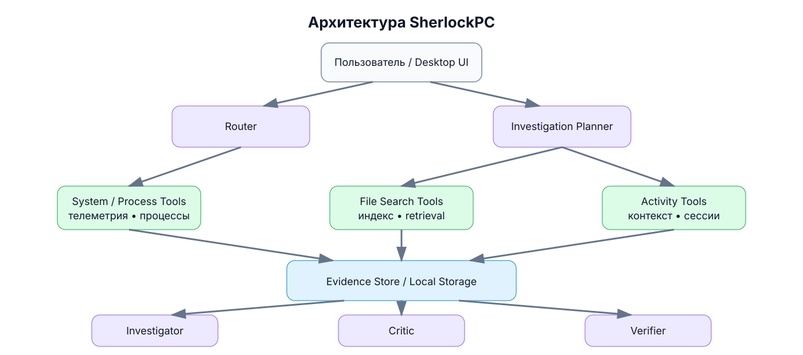

# Архитектура SherlockPC

> **Статус:** design / MVP  
> **Платформа MVP:** Windows  
> **Принцип:** deterministic capabilities + bounded AI reasoning



## 1. Цель архитектуры

SherlockPC — локальная evidence-driven система расследований для персонального компьютера. Архитектура специально разделяет сбор фактов, аналитические методы и AI-reasoning, чтобы модель не могла подменять реальные системные данные правдоподобными догадками.

Главное правило:

> **Нет доказательств → нет фактического утверждения.**

Центральный пользовательский объект — **Sherlock Case File**, а не чат. Каждый нетривиальный запрос превращается в ограниченное расследование с планом, evidence, гипотезами, проверкой альтернатив и верификацией результата.

---

## 2. Основные слои

### Observe

Получение локальных сигналов:

- системная телеметрия;
- процессы и их жизненный цикл;
- файловые события;
- активные приложения;
- пользовательский activity context.

Этот слой максимально детерминирован. Он не должен использовать LLM для действий, которые можно получить через системные API.

### Remember

Формирование структурированной истории:

- event timeline;
- process history;
- file index;
- work sessions;
- state snapshots;
- evidence store.

Хранилище MVP — SQLite. Vector retrieval скрывается за отдельным интерфейсом.

### Understand

Аналитический слой:

- behavioral baseline;
- anomaly detection;
- state diff;
- semantic retrieval;
- hybrid ranking;
- sessionization.

Для первой версии предпочтительны интерпретируемые методы: rolling median, MAD, EWMA и change-point detection.

### Investigate

AI-reasoning включается только тогда, когда действительно нужен:

- Router;
- Investigation Planner;
- Investigator;
- Critic;
- Verifier.

### Act

Любое изменение системы оформляется как `ActionProposal`. LLM не получает unrestricted shell. Выполнение проходит через независимый Policy Engine и Audit Log.

---

## 3. Investigation Engine


Это **bounded state machine**, а не бесконечный autonomous loop.

Ограничения могут включать:

```text
max_tool_calls
max_investigation_rounds
time_budget
minimum_evidence_threshold
```

Поддерживаемые состояния завершения:

```text
CONCLUDED
INSUFFICIENT_EVIDENCE
AMBIGUOUS
NO_ANOMALY_FOUND
DATA_UNAVAILABLE
```

---

## 4. Reasoning-компоненты

| Компонент | Задача |
|---|---|
| Router | Определяет тип расследования |
| Planner | Выбирает необходимые capability calls |
| Investigator | Формирует и ранжирует гипотезы |
| Critic | Ищет контрпримеры и сильные альтернативы |
| Verifier | Проверяет groundedness и достаточность evidence |

`System`, `Process`, `Filesystem`, `Activity` и `Search` — capability providers, а не отдельные агенты.

---

## 5. Evidence model

Evidence хранится в строгой структуре:

```json
{
  "evidence_id": "EV-1842",
  "type": "metric_change",
  "source": "system_metrics",
  "metric": "memory_usage",
  "window": {
    "start": "2026-09-08T14:30:00",
    "end": "2026-09-08T14:35:00"
  },
  "observation": {
    "before": 61.2,
    "after": 91.4,
    "unit": "%"
  },
  "baseline": {
    "expected_range": [54.0, 69.0]
  },
  "anomaly_score": 4.8,
  "reliability": "high",
  "raw_reference": "metrics:894120-894420"
}
```

Гипотезы ссылаются на evidence по ID:

```json
{
  "hypothesis_id": "H1",
  "statement": "Docker Desktop caused memory pressure",
  "supports": ["EV-1842", "EV-1848", "EV-1850"],
  "contradicts": [],
  "alternatives": ["H2", "H3"]
}
```

Verifier должен уметь автоматически проверять, что существенные утверждения Case File имеют достаточную поддержку.

---

## 6. State Diff

`State Diff` — фундаментальный primitive диагностической части SherlockPC.

```text
State A
последнее состояние, когда всё работало

        VS

State B
текущее проблемное состояние
```

Пример результата:

```text
Memory available        -5.4 GB
Free disk               -38.9 GB
Docker                   stopped → running
Discord                  stopped → running
GPU driver               unchanged
OS version               changed
Process count            +31
Background disk I/O      +184%
```

Investigator получает не «сырой компьютер», а конкретный список изменений, потенциально объясняющих наблюдаемую проблему.

---

## 7. Background Service

В фоновом режиме Sherlock выполняет только необходимые операции:

```text
collect
normalize
aggregate
index
detect
```

Рекомендуемое распределение:

| Операция | Реализация |
|---|---|
| CPU / RAM / disk metrics | deterministic |
| process events | deterministic |
| filesystem events | deterministic |
| anomaly detection | statistical |
| sessionization | rules / clustering |
| embeddings | batch / on-change |
| investigation | on demand |

LLM не должен работать постоянно.

---

## 8. Platform Adapter

```python
class PlatformAdapter:
    def get_processes(self):
        ...

    def get_active_application(self):
        ...

    def get_system_metrics(self):
        ...

    def watch_files(self):
        ...

    def get_application_events(self):
        ...
```

План:

```text
WindowsAdapter     ← MVP
LinuxAdapter       ← later
MacOSAdapter       ← later
```

Архитектура cross-platform, реализация MVP — Windows-first.

---

## 9. Предлагаемая структура проекта

```text
sherlockpc/
│
├── apps/
│   └── desktop/
│
├── sherlock/
│   ├── investigation/
│   │   ├── router/
│   │   ├── planner/
│   │   ├── investigator/
│   │   ├── critic/
│   │   └── verifier/
│   │
│   ├── capabilities/
│   │   ├── telemetry/
│   │   ├── processes/
│   │   ├── filesystem/
│   │   └── activity/
│   │
│   ├── intelligence/
│   │   ├── anomalies/
│   │   ├── baseline/
│   │   ├── retrieval/
│   │   ├── ranking/
│   │   ├── sessionization/
│   │   └── embeddings/
│   │
│   ├── storage/
│   │   ├── sqlite/
│   │   └── vectors/
│   │
│   ├── platform/
│   │   ├── base.py
│   │   └── windows/
│   │
│   ├── permissions/
│   │   ├── policy.py
│   │   ├── proposals.py
│   │   └── audit.py
│   │
│   └── providers/
│       └── llm/
│
├── simulator/
├── benchmarks/
├── tests/
└── docs/
```

---

## 10. Data model

Основные сущности:

- `system_metrics`;
- `process_events`;
- `process_samples`;
- `files`;
- `file_chunks`;
- `activity_events`;
- `sessions`;
- `cases`;
- `evidence`;
- `hypotheses`;
- `hypothesis_evidence`;
- `action_proposals`.

Ключевая связь:

```text
Case
 ├── Evidence
 ├── Hypotheses
 │    └── HypothesisEvidence
 └── ActionProposals
```

---

## 11. SherlockBench

Production pipeline и benchmark pipeline должны быть максимально одинаковыми.

```text
Synthetic / controlled scenario
            ↓
     normal event format
            ↓
  Investigation Engine
            ↓
       Sherlock Case
            ↓
      benchmark metrics
```

Основные метрики:

- Top-1 Accuracy;
- Top-3 Recall;
- False Alarm Rate;
- Detection Latency;
- Unsupported Claim Rate;
- Alternative Coverage;
- Tool Calls;
- Token Usage;
- Investigation Latency.

Это позволяет сравнивать `Single Investigator`, `+ Critic` и `+ Critic + Verifier` количественно.

---

## 12. Архитектурные инварианты

1. Privacy Policy применяется **до хранения**.
2. LLM не имеет unrestricted shell.
3. Существенный factual claim должен ссылаться на evidence.
4. Correlation не автоматически превращается в causation.
5. Investigation Engine имеет конечный budget.
6. Система может завершить дело без диагноза.
7. Сырые capability calls по возможности детерминированы.
8. AI reasoning отделён от policy enforcement.
9. Local mode — основной режим проекта.

## 13. Desktop Alpha boundary

Первый desktop-слой не переносит reasoning во frontend и не даёт UI произвольный доступ к Python или shell.

```text
React / TypeScript UI
        ↓ Tauri invoke
fixed Rust command: backend_call
        ↓ JSON stdin/stdout
Python desktop bridge
        ↓ allow-listed operations
DesktopService
        ├── StateCollector
        ├── SQLite repositories
        └── bounded Investigation Engine
```

На этапе Alpha разрешены только фиксированные backend actions: `ping`, `overview`, `capture_state`, `recent_states`, `investigate`. Текст диагностического вопроса пока не является командой для LLM и не преобразуется в shell-вызовы.

Для development Tauri запускает локальный Python из репозитория. Release packaging должен заменить это на bundled Python sidecar, чтобы конечному пользователю не требовалась отдельная установка Python.

