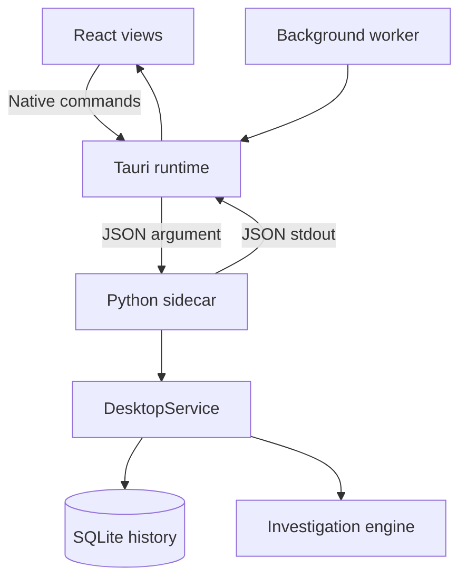

# SherlockPC desktop — v0.1

[English README](../README.md) · [Русский README](../README.ru.md) · [Documentation](README.md) · [File index](files.md) · [CLI guide](cli.md)

The released Windows desktop uses React, Tauri 2 and a bundled Python backend. End users install the NSIS package; they do not need a Python, Node.js or Rust installation.

## Runtime and background collection



- [lib.rs](../desktop/src-tauri/src/lib.rs) starts the worker and serializes collection and backend requests. It targets a sample about every 10 seconds, including when the window is hidden.
- [background.rs](../desktop/src-tauri/src/background.rs) handles the tray and optional sign-in autostart. Closing the window hides it; **Exit — stop collecting** exits. A single-instance plugin prevents duplicate desktop instances.
- Each backend request starts a one-shot sidecar. The Rust worker, rather than a long-running Python process, maintains background collection.
- [desktop_bridge.py](../sherlock/desktop_bridge.py) dispatches explicit operations to [DesktopService](../sherlock/desktop/service.py): `ping`, `overview`, `capture_state`, `recent_states`, `history_info`, `history_page`, `open_history_folder`, `clear_history`, `investigate`. Unknown actions are rejected.
- Native commands also expose monitor status, manual refresh, startup settings and locale synchronization. The UI has no generic shell command endpoint.

The backend is built by [build_desktop_sidecar.py](../build_support/build_desktop_sidecar.py) using PyInstaller `--onefile`, and included through `bundle.externalBin` in [tauri.conf.json](../desktop/src-tauri/tauri.conf.json).

## Storage

Packaged Windows default:

```text
%LOCALAPPDATA%\SherlockPC\data\sherlock.db
```

`SHERLOCK_DB_PATH` overrides this for development and tests. See [default_database_path](../sherlock/desktop_bridge.py) and [history management](../sherlock/desktop/history.py). History and Settings show the actual path. Stop the application through the tray before copying the data folder for a backup.

## Development on Windows

Install 64-bit Python 3.11+, Node.js 22.12+ and stable Rust with the `x86_64-pc-windows-msvc` toolchain. Also install Visual Studio Build Tools with C++ and Windows SDK, and WebView2 Runtime. The Windows CI configuration uses Python 3.12 and Node 24.

From the repository root:

```bat
RUN_DESKTOP_DEV.cmd
```

The [launcher](../RUN_DESKTOP_DEV.cmd) checks tools, prepares the Python build environment, builds the target-specific backend, installs frontend dependencies when needed and starts Tauri development mode.

## Build and package

```bat
BUILD_DESKTOP_WINDOWS.cmd
```

The [release builder](../BUILD_DESKTOP_WINDOWS.cmd) validates source files and tools, prepares an isolated Python environment, runs Python tests, builds and smoke-tests the backend, validates frontend types/tests, builds Tauri/NSIS, then invokes the [release packager](../build_support/package_desktop_release.py).

| Artifact | Location |
|---|---|
| Native application | `desktop/src-tauri/target/release/sherlockpc.exe` |
| Backend before bundling | `desktop/src-tauri/binaries/sherlock-backend-x86_64-pc-windows-msvc.exe` |
| NSIS build output | `desktop/src-tauri/target/release/bundle/nsis/SherlockPC_0.1.0_x64-setup.exe` |
| User installer | `release/SherlockPC-v0.1-Setup.exe` |
| Installer checksum | `release/SHA256SUMS.txt` |
| Published notes copy | `release/RELEASE_NOTES.md` |

[RELEASE_NOTES_v0.1.md](../RELEASE_NOTES_v0.1.md) is the source for the packaged notes. [VERSION](../VERSION) is the public version; npm/Cargo/Tauri use `0.1.0`. Outputs appear only after a successful Windows build; the source archive does not contain them.

Distribute the installer so that the native application and backend arrive together. [PACKAGE_DESKTOP_WINDOWS.cmd](../PACKAGE_DESKTOP_WINDOWS.cmd) packages existing build outputs; it does not replace a full build. [BUILD_WINDOWS.cmd](../BUILD_WINDOWS.cmd) and [BUILD_WINDOWS.ps1](../BUILD_WINDOWS.ps1) concern the separate collector build.

## Validation

Use the [README source checks](../README.md#source-checks) for Python, TypeScript, frontend and browser UI checks. Browser UI tests use a fixture and mock IPC; they cannot verify native integration.

On Windows, check installation and launch, tray hide/show, continued sampling while hidden, exit stopping collection, sign-in autostart, one-instance behavior, opening the data folder, confirmed clearing, and offline rendering of all languages. Automated workflows: [quality](../.github/workflows/quality.yml), [Windows build](../.github/workflows/windows-candidate.yml). The historical workflow name “candidate” does not change the public v0.1 release status.

## Build troubleshooting

| Error or symptom | Check |
|---|---|
| Missing Cargo or incorrect target | Install/select stable x64 MSVC Rust |
| Native linking failure | C++ Build Tools and Windows SDK |
| Missing backend | Build from the full tree and rerun the sidecar builder |
| No WebView | WebView2 Runtime on the target machine |
| Packager reports missing release notes | Keep `RELEASE_NOTES_v0.1.md` in the repository root |
| Installer cannot be replaced | Close any running installer before rebuilding |

[Documentation](README.md) · [File index](files.md) · [English README](../README.md) · [Русский README](../README.ru.md)
