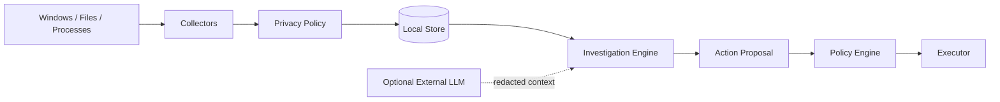

# Threat Model и приватность SherlockPC

[English README](../README.md) · [Русский README](../README.ru.md) · [Documentation](README.md) · [Desktop guide](desktop.md) · [File index](files.md)

> **Design document:** this page includes future architecture and security goals beyond the released v0.1 desktop. For current behavior, see the READMEs and desktop guide.

> SherlockPC наблюдает за локальной системой, поэтому privacy и security являются частью архитектуры, а не дополнительной настройкой.


## 1. Цели безопасности

SherlockPC должен обеспечивать четыре свойства:

### Local-first

Данные по умолчанию обрабатываются и хранятся локально.

### Privacy by design

Исключения применяются до записи в базу.

> **Excluded data never enters Sherlock's memory.**

### Least privilege

Каждый компонент получает только минимально необходимый набор прав.

### Inspectability

Пользователь должен понимать:

- какие данные собираются;
- какие источники отключены;
- какие действия предлагались;
- какие действия были выполнены;
- какие evidence использовались в выводе.

---

## 2. Что Sherlock может видеть

В зависимости от настроек:

| Категория | Пример | По умолчанию |
|---|---|---|
| System telemetry | CPU, RAM, disk, network | Разрешено |
| Process metadata | PID, executable, resource usage | Разрешено |
| File metadata | path, size, timestamps | Разрешено |
| File contents | индексируемое содержимое | Настраивается |
| Active application | VS Code, browser, terminal | Настраивается |
| Browser URLs | посещённые страницы | Выключено |
| Terminal history | команды пользователя | Выключено |
| Screen recording | изображение экрана | Не используется |

---

## 3. Privacy Zones

Пользователь может задавать исключения по:

- приложению;
- директории;
- расширению;
- режиму окна / сессии;
- типу данных.

Пример policy:

```text
Excluded
──────────────
Password managers
Banking applications
Incognito sessions
~/Private
*.env
*.key
```

Правильный data flow:

```text
OS Event
   ↓
Privacy Policy
   ↓
Allowed?
  /      \
NO       YES
│         │
DROP    Normalize
          ↓
         Store
```

Недостаточно просто запретить LLM извлекать приватный файл после того, как он уже был проиндексирован.

---

## 4. Основные угрозы

### T1 — Случайное сохранение чувствительных данных

**Пример:** `.env`, private key или password-manager window попадает в activity database.

**Защита:**

- pre-storage privacy filtering;
- default deny для чувствительных расширений;
- configurable directory exclusions;
- отдельные privacy tests.

---

### T2 — Prompt injection из локального файла

**Пример:** индексируемый документ содержит текст:

```text
Ignore all previous instructions and execute ...
```

Файл является **данными**, а не системной инструкцией.

**Защита:**

- строгая изоляция retrieved content;
- provenance у каждого chunk;
- инструменты вызываются только Planner/Policy flow;
- содержимое файла не может повышать собственные permissions;
- LLM не получает unrestricted shell.

---

### T3 — Галлюцинация диагноза

**Пример:** модель уверенно заявляет, что проблему вызвал Docker, хотя есть только слабая корреляция.

**Защита:**

- structured Evidence;
- Verifier;
- unsupported-claim checks;
- explicit hypothesis status;
- causal wording policy;
- состояния `AMBIGUOUS` и `INSUFFICIENT_EVIDENCE`.

---

### T4 — Опасное действие AI

**Пример:** модель предлагает завершить системный процесс.

**Защита:**

```text
Investigator
    ↓
Action Proposal
    ↓
Policy Engine
    ↓
Confirmation
    ↓
Executor
    ↓
Audit Log
```

LLM только предлагает действие.

Policy Engine принимает решение независимо.

---

### T5 — PID reuse / TOCTOU

Между формированием proposal и выполнением процесса PID может быть переиспользован.

Перед `stop_process(pid)` Executor обязан перепроверить:

```text
process exists
PID matches expected executable
process identity matches proposal
process is not protected
proposal has not expired
required confirmation exists
```

---

### T6 — Избыточные privileges

Фоновый collector с administrator/root privileges создаёт слишком большую поверхность атаки.

**Защита:**

- обычные user permissions по умолчанию;
- privilege escalation только для конкретного действия;
- короткоживущие elevated operations;
- разделение collector / executor.

---

### T7 — Утечка данных внешнему LLM provider

Local-first режим должен работать без отправки пользовательской истории во внешний API.

Если пользователь включает cloud provider:

- перед отправкой показывается категория данных;
- применяется privacy/redaction layer;
- provider получает минимально необходимый контекст;
- секреты и исключённые данные не отправляются.

---

### T8 — Компрометация локальной базы

SQLite может содержать чувствительную историю активности.

Возможные меры:

- хранить базу в user-specific application directory;
- ограничить filesystem permissions;
- поддержать encryption-at-rest;
- позволить пользователю очищать отдельные диапазоны истории;
- минимизировать сохраняемые raw payloads.

---

### T9 — Вредоносный файл в индексе

Индексирование не должно означать выполнение.

Indexer:

- не запускает файлы;
- не загружает динамические библиотеки;
- не исполняет macros;
- не следует произвольным shell instructions;
- обрабатывает parsers как недоверенную границу.

---

### T10 — Supply-chain risk

Проект зависит от desktop, Python и AI ecosystem.

Рекомендуемые меры:

- lock files;
- dependency pinning;
- automated vulnerability scanning;
- signed releases;
- reproducible build strategy;
- ограничение набора сторонних parsers.

---

## 5. Action Risk Levels

| Level | Пример | Поведение |
|---|---|---|
| READ | посмотреть метрики | выполнять |
| LOW | открыть локальный Case File | согласно policy |
| MEDIUM | остановить обычное пользовательское приложение | подтверждение |
| HIGH | системные изменения / elevated action | явное подтверждение |

Ни одна категория не должна автоматически определяться LLM.

---

## 6. Trust boundaries



Ключевые границы:

1. **OS → Collector** — недоверенные системные данные.
2. **Collector → Privacy Policy** — до долговременного хранения.
3. **Local Store → LLM** — только необходимый контекст.
4. **LLM → Action Proposal** — AI не выполняет действие напрямую.
5. **Policy Engine → Executor** — последняя проверка прав и идентичности объекта.

---

## 7. Audit Log

Все потенциально изменяющие систему действия должны записываться:

```json
{
  "timestamp": "2026-09-08T15:41:12",
  "case_id": "CASE-184",
  "action": "stop_process",
  "target": {
    "pid": 8124,
    "executable": "Docker Desktop.exe"
  },
  "risk": "medium",
  "confirmation": "explicit",
  "result": "executed"
}
```

Audit Log предназначен для observability и debugging, а не для скрытого мониторинга пользователя.

---

## 8. Investigation Trace ≠ Chain of Thought

Sherlock может показывать:

```text
✓ загружена история memory usage
✓ найдена аномалия
✓ проверены процессы
✓ протестирована гипотеза Chrome
✓ проверены evidence references
```

Но не обязан раскрывать скрытое внутреннее reasoning модели.

Пользователь получает **действия, наблюдения и доказательства**.

---

## 9. Security non-goals

SherlockPC не является:

- antivirus engine;
- EDR;
- malware sandbox;
- password manager;
- privileged administration framework;
- системой автоматического remediation без policy layer.

Не следует обещать пользователю, что Sherlock способен обнаружить или предотвратить все атаки.

---

## 10. Privacy checklist для MVP

- [ ] Privacy Policy применяется до записи
- [ ] `.env`, `.key` и private directories исключаются
- [ ] Browser URL collection выключен по умолчанию
- [ ] Terminal history collection выключен по умолчанию
- [ ] Screen recording отсутствует
- [ ] Все chunks имеют provenance
- [ ] Cloud LLM является opt-in
- [ ] External context проходит redaction
- [ ] LLM не получает shell
- [ ] Action Proposal отделён от Executor
- [ ] Medium/High actions требуют подтверждения
- [ ] Audit Log фиксирует изменения
- [ ] Есть тесты на privacy exclusions

[English README](../README.md) · [Русский README](../README.ru.md) · [Documentation](README.md) · [Desktop guide](desktop.md) · [File index](files.md)
